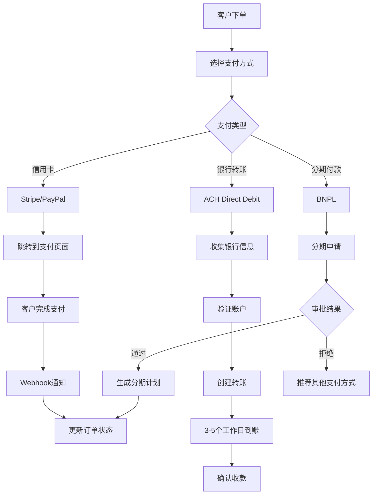

# Nestopia Platform Payment Solution Design
# 支付解决方案设计

**面向市场**: 美国小型企业  
**版本**: 1.0.0  
**最后更新**: 2026-01-30  

---

## 1. 市场分析 (Market Analysis)

### 1.1 美国支付市场特点
| 特点 | 数据 | 影响 |
|------|------|------|
| **信用卡普及率** | 83% | 必须支持信用卡支付 |
| **移动支付** | 52% | 需要支持Apple Pay/Google Pay |
| **ACH转账** | 逐年增长 | 银行转账需求增加 |
| **分期付款** | 年轻消费者偏好 | 考虑BNPL方案 |

### 1.2 目标客户支付习惯
```
高端客户 (35-55岁)
├── 偏好: 信用卡支付
├── 关注: 安全性、品牌信誉
└── 平均订单: $5,000-15,000

年轻家庭 (28-40岁)
├── 偏好: 分期付款、移动支付
├── 关注: 便利性、灵活性
└── 平均订单: $3,000-8,000

渠道商 (B2B)
├── 偏好: 银行转账、Net 30账期
├── 关注: 企业账户、发票管理
└── 平均订单: $10,000-50,000
```

---

## 2. 支付方案选择 (Payment Options)

### 2.1 推荐方案组合

| 方案 | 适用场景 | 费率 | 集成难度 | 推荐指数 |
|------|----------|------|----------|----------|
| **Stripe** | 在线信用卡支付 | 2.9% + $0.30 | ⭐⭐⭐⭐⭐ | ⭐⭐⭐⭐⭐ |
| **PayPal** | 国际客户、移动支付 | 3.49% + $0.49 | ⭐⭐⭐⭐⭐ | ⭐⭐⭐⭐ |
| **Square** | 线下收款、移动POS | 2.6% + $0.10 | ⭐⭐⭐⭐ | ⭐⭐⭐ |
| **ACH Direct Debit** | 大额转账、B2B | $1-3 | ⭐⭐⭐ | ⭐⭐⭐⭐ |
| **Klarna/Afterpay** | 分期付款 | 服务费另计 | ⭐⭐ | ⭐⭐⭐ |

### 2.2 方案详细对比

#### 2.2.1 Stripe (主推荐)
```yaml
优势:
  - 美国市场占有率最高 (30%+)
  - 开发者友好，文档完善
  - 支持所有主流支付方式
  - 优秀的欺诈防护
  - 适合订阅和一次性支付

劣势:
  - 费率相对较高
  - 需要美国实体(或使用Stripe Atlas)

集成示例:
  # 前端
  const stripe = Stripe('pk_test_xxx');
  const {error} = await stripe.redirectToCheckout({
    lineItems: [{price: 'price_xxx', quantity: 1}],
    mode: 'payment',
    successUrl: 'https://yoursite.com/success',
    cancelUrl: 'https://yoursite.com/cancel'
  });

  # 后端 (Node.js)
  const paymentIntent = await stripe.paymentIntents.create({
    amount: 500000,  // $5000.00
    currency: 'usd',
    payment_method_types: ['card', 'apple_pay', 'google_pay']
  });
```

#### 2.2.2 PayPal
```yaml
优势:
  - 全球用户基础大
  - 客户信任度高
  - 支持PayPal余额支付
  - 适合国际交易

劣势:
  - 费率较高
  - 退款处理复杂
  - 用户体验不如Stripe流畅

集成方式:
  - PayPal Checkout (推荐)
  - PayPal Smart Buttons
  - PayPal REST API
```

#### 2.2.3 ACH Direct Debit
```yaml
优势:
  - 费用极低 ($1-3/笔)
  - 适合大额B2B交易
  - 客户接受度高(美国习惯)

劣势:
  - 处理时间长(3-5工作日)
  - 退款复杂
  - 需要银行账户验证

适用场景:
  - B2B订单 > $5000
  - 定期付款(维护费)
  - 分期付款首期
```

#### 2.2.4 BNPL (Buy Now Pay Later)
```yaml
提供商:
  - Klarna
  - Afterpay
  - Affirm
  - Sezzle

优势:
  - 提高转化率(15-30%)
  - 吸引年轻消费者
  - 无信用卡也可购买

劣势:
  - 服务费较高(5-10%)
  - 增加坏账风险
  - 需要额外合规审查

建议:
  - 订单 > $1000 提供分期选项
  - 与主支付方式并行提供
```

---

## 3. 支付流程设计 (Payment Flow)

### 3.1 标准在线支付流程


### 3.2 支付状态管理
```sql
-- 支付状态流转
pending(待支付) 
  └── processing(处理中)
      ├── completed(已完成)
      ├── failed(失败)
      └── cancelled(已取消)

-- 退款状态
completed 
  └── refunded(已退款)
      └── refund_failed(退款失败)
```

---

## 4. 技术实现方案 (Technical Implementation)

### 4.1 支付服务架构
```
┌─────────────────────────────────────────────────┐
│              Payment Service                    │
├─────────────────────────────────────────────────┤
│  ┌─────────────┐  ┌─────────────┐  ┌─────────┐ │
│  │ Stripe API  │  │ PayPal API  │  │ ACH API │ │
│  └─────────────┘  └─────────────┘  └─────────┘ │
│                                                 │
│  ┌─────────────────────────────────────────┐   │
│  │         Payment Gateway Router          │   │
│  │  - 路由到不同支付提供商                 │   │
│  │  - 统一接口抽象                         │   │
│  └─────────────────────────────────────────┘   │
│                                                 │
│  ┌─────────────────────────────────────────┐   │
│  │           Webhook Handler               │   │
│  │  - 异步通知处理                         │   │
│  │  - 状态同步                             │   │
│  └─────────────────────────────────────────┘   │
└─────────────────────────┬───────────────────────┘
                          │
                          ▼
┌─────────────────────────────────────────────────┐
│              Database Layer                     │
├─────────────────────────────────────────────────┤
│  payments表: 记录所有支付交易                   │
│  payment_methods表: 客户支付方式                │
│  refund_records表: 退款记录                     │
└─────────────────────────────────────────────────┘
```

### 4.2 核心代码示例

#### 4.2.1 支付服务接口
```typescript
// services/payment.service.ts

interface PaymentRequest {
  orderId: string;
  amount: number;
  currency: string;
  method: 'stripe' | 'paypal' | 'ach' | 'bnpl';
  customerInfo: {
    email: string;
    name: string;
    phone?: string;
  };
  returnUrl?: string;
}

interface PaymentResponse {
  paymentId: string;
  status: 'pending' | 'processing' | 'completed' | 'failed';
  redirectUrl?: string;
  clientSecret?: string;
}

class PaymentService {
  async createPayment(request: PaymentRequest): Promise<PaymentResponse> {
    switch (request.method) {
      case 'stripe':
        return this.createStripePayment(request);
      case 'paypal':
        return this.createPayPalPayment(request);
      case 'ach':
        return this.createACHPayment(request);
      case 'bnpl':
        return this.createBNPLPayment(request);
      default:
        throw new Error('Unsupported payment method');
    }
  }

  private async createStripePayment(request: PaymentRequest): Promise<PaymentResponse> {
    const stripe = new Stripe(process.env.STRIPE_SECRET_KEY);
    
    const paymentIntent = await stripe.paymentIntents.create({
      amount: Math.round(request.amount * 100), // cents
      currency: request.currency,
      metadata: {
        orderId: request.orderId,
        customerEmail: request.customerInfo.email
      },
      automatic_payment_methods: {
        enabled: true,
      }
    });

    return {
      paymentId: paymentIntent.id,
      status: 'pending',
      clientSecret: paymentIntent.client_secret
    };
  }

  async handleWebhook(payload: any, signature: string): Promise<void> {
    // 验证签名
    const event = stripe.webhooks.constructEvent(
      payload,
      signature,
      process.env.STRIPE_WEBHOOK_SECRET
    );

    // 处理不同事件类型
    switch (event.type) {
      case 'payment_intent.succeeded':
        await this.handlePaymentSuccess(event.data.object);
        break;
      case 'payment_intent.payment_failed':
        await this.handlePaymentFailed(event.data.object);
        break;
    }
  }
}
```

#### 4.2.2 前端集成
```javascript
// components/PaymentForm.jsx

import { loadStripe } from '@stripe/stripe-js';
import { Elements, CardElement, useStripe, useElements } from '@stripe/react-stripe-js';

const stripePromise = loadStripe(process.env.REACT_APP_STRIPE_PUBLISHABLE_KEY);

function CheckoutForm({ orderId, amount }) {
  const stripe = useStripe();
  const elements = useElements();

  const handleSubmit = async (event) => {
    event.preventDefault();
    
    if (!stripe || !elements) return;

    // 创建支付意向
    const response = await fetch('/api/payments/create', {
      method: 'POST',
      headers: { 'Content-Type': 'application/json' },
      body: JSON.stringify({
        orderId,
        amount,
        method: 'stripe'
      })
    });

    const { clientSecret } = await response.json();

    // 确认支付
    const result = await stripe.confirmCardPayment(clientSecret, {
      payment_method: {
        card: elements.getElement(CardElement),
        billing_details: {
          name: '客户姓名',
          email: 'customer@example.com'
        }
      }
    });

    if (result.error) {
      console.error(result.error.message);
    } else {
      // 支付成功
      window.location.href = '/payment-success';
    }
  };

  return (
    <form onSubmit={handleSubmit}>
      <CardElement />
      <button type="submit" disabled={!stripe}>
        支付 ${amount}
      </button>
    </form>
  );
}

export default function PaymentPage({ orderId, amount }) {
  return (
    <Elements stripe={stripePromise}>
      <CheckoutForm orderId={orderId} amount={amount} />
    </Elements>
  );
}
```

---

## 5. 合规与安全 (Compliance & Security)

### 5.1 PCI DSS 合规
```yaml
要求:
  - 使用PCI DSS合规的支付处理器(Stripe, PayPal)
  - 不在服务器存储完整卡号
  - 传输过程加密(TLS 1.3)
  - 定期安全扫描

实现:
  - Stripe Elements (前端收集卡信息)
  - Tokenization (卡号转为token)
  - Scope reduction (最小化PCI范围)
```

### 5.2 数据保护
```yaml
加密存储:
  - 客户支付信息: AES-256加密
  - 敏感字段: 数据库级别加密
  - 传输过程: HTTPS/TLS

访问控制:
  - 最小权限原则
  - 审计日志记录
  - 定期权限审查
```

### 5.3 欺诈防护
```yaml
措施:
  - Stripe Radar (机器学习风控)
  - 3D Secure 2.0 (SCA合规)
  - 异常交易监控
  - 地理位置验证
  - 设备指纹识别
```

---

## 6. 定价与成本分析 (Pricing & Cost Analysis)

### 6.1 支付处理费率对比

| 支付方式 | 费率 | 每$1000订单成本 | 适用场景 |
|----------|------|----------------|----------|
| **Stripe信用卡** | 2.9% + $0.30 | $29.30 | 标准在线支付 |
| **PayPal** | 3.49% + $0.49 | $35.39 | 国际客户 |
| **ACH转账** | $1-3 | $1-3 | B2B大额 |
| **Klarna分期** | 5-10% | $50-100 | 分期付款 |

### 6.2 月度成本估算 (假设$50K月交易额)

```yaml
Stripe费用: $50,000 × 2.9% + (50订单 × $0.30) = $1,450 + $15 = $1,465
PayPal费用: $50,000 × 3.49% + (30订单 × $0.49) = $1,745 + $14.7 = $1,759.7
ACH费用: 20笔 × $2 = $40
总计月费用: ~$3,265 (约占交易额0.65%)
```

### 6.3 ROI 分析
```yaml
投入:
  - 支付系统开发: $15,000 (一次性)
  - 月度支付费用: $3,265
  - 维护成本: $500/月

收益:
  - 提高转化率: +15% (假设月增$7,500收入)
  - 减少人工收款: 节省$2,000/月
  - 提升客户体验: 品牌价值提升

ROI: 6-12个月内回本
```

---

## 7. 实施路线图 (Implementation Roadmap)

### Phase 1: MVP (1-2个月)
```yaml
目标: 基础在线支付功能
功能:
  - Stripe信用卡支付
  - 订单支付状态管理
  - 基础退款功能
  - 支付成功/失败页面

技术栈:
  - Stripe API
  - PostgreSQL (payments表)
  - Express.js后端
```

### Phase 2: 扩展功能 (2-3个月)
```yaml
目标: 多支付方式支持
功能:
  - PayPal集成
  - ACH银行转账
  - 客户支付方式保存
  - 付款计划管理
```

### Phase 3: 高级功能 (3-6个月)
```yaml
目标: 企业级支付能力
功能:
  - BNPL分期付款
  - 订阅支付
  - 多币种支持
  - 高级报表分析
```

---

## 8. 风险与缓解 (Risks & Mitigation)

### 8.1 技术风险
| 风险 | 影响 | 缓解措施 |
|------|------|----------|
| 支付网关故障 | 交易中断 | 多提供商备份 |
| 集成复杂度 | 开发延期 | 使用成熟SDK |
| 安全漏洞 | 资金损失 | 定期安全审计 |

### 8.2 业务风险
| 风险 | 影响 | 缓解措施 |
|------|------|----------|
| 费率上涨 | 成本增加 | 合同锁定费率 |
| 合规变更 | 运营中断 | 专业法务支持 |
| 客户退款 | 收入损失 | 严格退款政策 |

---

*本文档将随项目迭代持续更新*  
*Last updated: 2026-01-30*