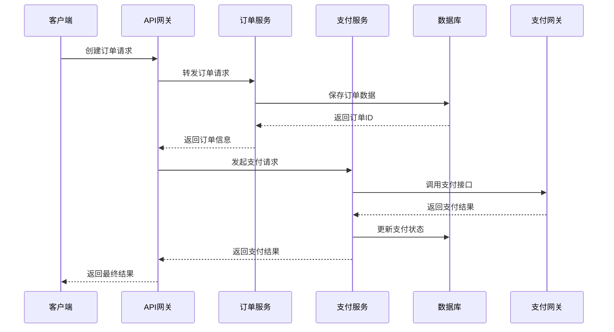
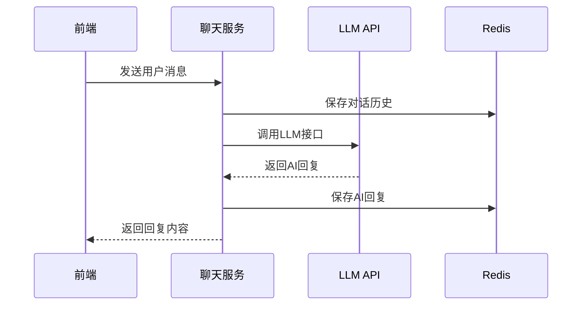
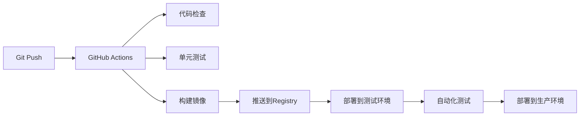

# Nestopia Platform Technical Architecture
# 技术架构文档

**版本**: 1.0.0  
**最后更新**: 2026-01-30  

---

## 1. 架构概览 (Architecture Overview)

### 1.1 整体架构图
```
┌─────────────────────────────────────────────────────────────────────┐
│                            Client Layer                             │
├─────────────────────────────────────────────────────────────────────┤
│  ┌─────────────┐  ┌─────────────┐  ┌─────────────┐  ┌─────────────┐ │
│  │   Web App   │  │ Mobile Web  │  │   Admin UI  │  │  Chatbot UI │ │
│  │ (Customers) │  │ (Customers) │  │  (Internal) │  │  (Embedded) │ │
│  └─────────────┘  └─────────────┘  └─────────────┘  └─────────────┘ │
└─────────────────────────┬───────────────────────────────────────────┘
                          │
                          ▼
┌─────────────────────────────────────────────────────────────────────┐
│                         API Gateway Layer                           │
├─────────────────────────────────────────────────────────────────────┤
│  ┌─────────────┐  ┌─────────────┐  ┌─────────────┐  ┌─────────────┐ │
│  │  REST API   │  │ GraphQL API │  │  WebSocket  │  │    SSE      │ │
│  │   (Public)  │  │  (Internal) │  │  (Realtime) │  │ (Streaming) │ │
│  └─────────────┘  └─────────────┘  └─────────────┘  └─────────────┘ │
└─────────────────────────┬───────────────────────────────────────────┘
                          │
                          ▼
┌─────────────────────────────────────────────────────────────────────┐
│                        Service Layer                                │
├─────────────────────────────────────────────────────────────────────┤
│  ┌─────────────┐  ┌─────────────┐  ┌─────────────┐  ┌─────────────┐ │
│  │  User Svc   │  │ Product Svc │  │  Order Svc  │  │ Payment Svc │ │
│  └─────────────┘  └─────────────┘  └─────────────┘  └─────────────┘ │
│  ┌─────────────┐  ┌─────────────┐  ┌─────────────┐  ┌─────────────┐ │
│  │ Design Svc  │  │  Chat Svc   │  │  File Svc   │  │  Email Svc  │ │
│  └─────────────┘  └─────────────┘  └─────────────┘  └─────────────┘ │
└─────────────────────────┬───────────────────────────────────────────┘
                          │
                          ▼
┌─────────────────────────────────────────────────────────────────────┐
│                        Data Layer                                   │
├─────────────────────────────────────────────────────────────────────┤
│  ┌─────────────┐  ┌─────────────┐  ┌─────────────┐  ┌─────────────┐ │
│  │ PostgreSQL  │  │   Redis     │  │   MinIO     │  │ Elasticsearch│ │
│  │ (Primary)   │  │ (Cache)     │  │ (Storage)   │  │ (Search)     │ │
│  └─────────────┘  └─────────────┘  └─────────────┘  └─────────────┘ │
└─────────────────────────┬───────────────────────────────────────────┘
                          │
                          ▼
┌─────────────────────────────────────────────────────────────────────┐
│                      External Services                              │
├─────────────────────────────────────────────────────────────────────┤
│  ┌─────────────┐  ┌─────────────┐  ┌─────────────┐  ┌─────────────┐ │
│  │  Qwen API   │  │ Payment GW  │  │ SMS Service │  │ CDN Service │ │
│  └─────────────┘  └─────────────┘  └─────────────┘  └─────────────┘ │
└─────────────────────────────────────────────────────────────────────┘
```

---

## 2. 技术栈选型 (Technology Stack)

### 2.1 前端技术栈
| 层级 | 技术 | 说明 |
|------|------|------|
| **框架** | React 18 + TypeScript | 组件化开发 |
| **样式** | Tailwind CSS + PostCSS | 原子化CSS |
| **状态管理** | Zustand / Context API | 轻量级状态管理 |
| **路由** | React Router v6 | 客户端路由 |
| **构建工具** | Vite 5 | 快速构建 |
| **部署** | GitHub Pages (静态) | 原型阶段 |

### 2.2 后端技术栈
| 层级 | 技术 | 说明 |
|------|------|------|
| **运行时** | Node.js 18+ | 服务器端JS |
| **框架** | Express.js | Web框架 |
| **API** | REST + GraphQL | 多协议支持 |
| **实时通信** | Socket.IO | WebSocket |
| **部署** | 阿里云ECS/Serverless | 云原生 |

### 2.3 数据库技术栈
| 类型 | 技术 | 用途 |
|------|------|------|
| **主数据库** | PostgreSQL 14+ | 核心业务数据 |
| **缓存** | Redis 7+ | 会话、缓存 |
| **对象存储** | MinIO / OSS | 文件存储 |
| **搜索** | Elasticsearch | 全文搜索 |

### 2.4 云服务选型
| 服务 | 提供商 | 用途 |
|------|--------|------|
| **IaaS** | 阿里云 | 基础设施 |
| **LLM** | 阿里云百炼(Qwen) | AI服务 |
| **CDN** | 阿里云CDN | 静态资源加速 |
| **监控** | 阿里云ARMS | 应用监控 |

---

## 3. 核心服务设计 (Core Services)

### 3.1 用户服务 (User Service)
```
功能: 用户认证、授权、管理
端口: 3001
API:
  POST   /api/auth/login
  POST   /api/auth/register
  GET    /api/users/profile
  PUT    /api/users/profile
依赖: PostgreSQL(users表), Redis(会话)
```

### 3.2 产品服务 (Product Service)
```
功能: 产品管理、分类、定价
端口: 3002
API:
  GET    /api/products
  GET    /api/products/:id
  POST   /api/products
  PUT    /api/products/:id
依赖: PostgreSQL(products, pricing表)
```

### 3.3 订单服务 (Order Service)
```
功能: 订单创建、状态管理
端口: 3003
API:
  POST   /api/orders
  GET    /api/orders/:id
  PUT    /api/orders/:id/status
依赖: PostgreSQL(orders, order_items表)
```

### 3.4 聊天服务 (Chat Service)
```
功能: AI客服、消息处理
端口: 3004
API:
  POST   /api/chat
  POST   /api/chat/stream
  GET    /api/chat/history
依赖: LLM API, Redis(对话历史)
```

### 3.5 支付服务 (Payment Service)
```
功能: 支付处理、退款
端口: 3005
API:
  POST   /api/payments
  POST   /api/payments/:id/refund
依赖: 支付网关API, PostgreSQL(payments表)
```

---

## 4. 数据流设计 (Data Flow)

### 4.1 用户下单流程


### 4.2 AI客服对话流程


---

## 5. 部署架构 (Deployment Architecture)

### 5.1 开发环境
```
┌─────────────────────────────────────┐
│           开发者本地环境             │
├─────────────────────────────────────┤
│  VS Code + Vite Dev Server (5173)   │
│  PostgreSQL (Docker)                │
│  Redis (Docker)                     │
└─────────────────────────────────────┘
```

### 5.2 测试环境
```
┌─────────────────────────────────────┐
│            阿里云测试环境             │
├─────────────────────────────────────┤
│  ECS实例 (2C4G)                     │
│  Docker Compose部署                 │
│  域名: test.nestopia.com            │
└─────────────────────────────────────┘
```

### 5.3 生产环境
```
┌─────────────────────────────────────┐
│            阿里云生产环境             │
├─────────────────────────────────────┤
│  负载均衡 SLB                       │
│  ECS集群 (4实例 4C8G)               │
│  RDS PostgreSQL                     │
│  Redis实例                          │
│  OSS存储                            │
│  CDN加速                            │
│  域名: www.nestopia.com             │
└─────────────────────────────────────┘
```

### 5.4 CI/CD 流水线


---

## 6. 安全架构 (Security Architecture)

### 6.1 认证授权
```
JWT Token (RS256)
├── Access Token (15分钟)
├── Refresh Token (7天)
└── 权限控制 (RBAC)
```

### 6.2 数据安全
- **传输加密**: HTTPS/TLS 1.3
- **数据加密**: AES-256 (敏感字段)
- **密码哈希**: bcrypt (12轮)
- **数据库**: 行级安全策略

### 6.3 API安全
- **速率限制**: 每IP每分钟100次
- **输入验证**: Joi schema validation
- **CORS策略**: 严格域名白名单
- **日志审计**: 完整操作记录

---

## 7. 性能优化 (Performance Optimization)

### 7.1 前端优化
| 优化项 | 技术方案 |
|--------|----------|
| **打包优化** | Vite + Tree Shaking |
| **代码分割** | React.lazy + Suspense |
| **图片优化** | WebP格式 + 懒加载 |
| **缓存策略** | Service Worker + Cache API |

### 7.2 后端优化
| 优化项 | 技术方案 |
|--------|----------|
| **数据库** | 连接池 + 索引优化 |
| **缓存** | Redis缓存热点数据 |
| **API** | 响应压缩 + 分页 |
| **CDN** | 静态资源CDN加速 |

### 7.3 数据库优化
```sql
-- 索引优化
CREATE INDEX idx_orders_customer_status ON orders(customer_id, status);
CREATE INDEX idx_products_category_active ON products(category_id, status);

-- 查询优化
EXPLAIN ANALYZE SELECT * FROM orders WHERE customer_id = ? AND status = 'pending';
```

---

## 8. 监控与运维 (Monitoring & Operations)

### 8.1 监控指标
```
应用指标:
├── API响应时间 < 200ms
├── 错误率 < 0.1%
├── 系统可用性 > 99.9%
└── 数据库连接数 < 80%

业务指标:
├── 订单转化率
├── 客户咨询量
├── 支付成功率
└── 用户满意度
```

### 8.2 日志架构
```
日志收集: Fluentd
日志存储: Elasticsearch
日志分析: Kibana
告警通知: 钉钉/邮件
```

### 8.3 备份策略
- **数据库**: 每日全量 + 每小时增量
- **文件**: OSS跨区域复制
- **代码**: GitHub多区域备份

---

## 9. 扩展性设计 (Scalability Design)

### 9.1 水平扩展
```
无状态服务: 可直接增加实例
有状态服务: 数据库读写分离
存储服务: 分布式文件系统
缓存服务: Redis集群
```

### 9.2 微服务拆分
```
Phase 1: 单体应用 (MVP)
Phase 2: 核心服务拆分 (用户、产品、订单)
Phase 3: 业务服务独立 (设计、支付、聊天)
Phase 4: 基础服务下沉 (通知、文件、搜索)
```

---

## 10. 技术债务与风险 (Tech Debt & Risks)

### 10.1 技术债务
| 项目 | 现状 | 计划解决时间 |
|------|------|--------------|
| 前端状态管理 | Context API | Q2 2026 |
| 数据库迁移 | 手动脚本 | Q1 2026 |
| 单元测试覆盖率 | 60% | Q2 2026 |

### 10.2 技术风险
| 风险 | 影响 | 缓解措施 |
|------|------|----------|
| LLM API限流 | 服务不可用 | 多提供商切换 |
| 支付网关故障 | 交易中断 | 本地队列缓冲 |
| 数据库性能瓶颈 | 查询慢 | 读写分离 |
| 第三方服务依赖 | 功能受限 | 降级方案 |

---

*本文档将随项目迭代持续更新*  
*Last updated: 2026-01-30*