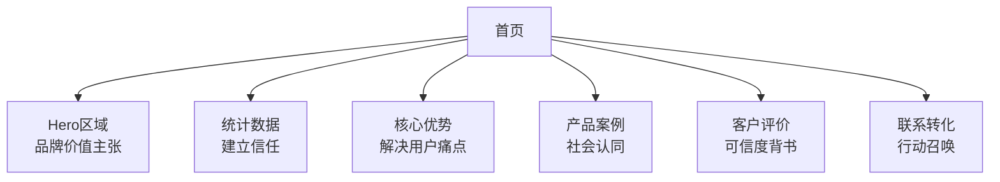

# Nestopia Platform UX Design Specification
# 用户体验设计规范

**版本**: 1.0.0  
**最后更新**: 2026-01-30  
**设计原则**: 简洁、专业、高效、信任

---

## 1. 设计理念 (Design Philosophy)

### 1.1 核心原则
```
专业性 > 美观性 > 交互性 > 一致性
```

### 1.2 目标用户画像
| 用户类型 | 特征 | 需求 |
|----------|------|------|
| **高端业主** | 35-55岁，别墅/洋房 | 品质优先，注重设计感 |
| **年轻家庭** | 28-40岁，改善型住房 | 性价比，实用功能 |
| **设计师** | 专业用户 | 技术参数，定制能力 |
| **渠道商** | B2B用户 | 合作政策，支持服务 |

### 1.3 用户旅程地图
```
发现 → 了解 → 体验 → 咨询 → 决策 → 购买 → 安装 → 售后
  ↓      ↓      ↓      ↓      ↓      ↓      ↓      ↓
首页   产品页  案例页  聊天   设计   下单   施工   服务
```

---

## 2. 视觉设计系统 (Visual Design System)

### 2.1 色彩体系
```css
:root {
  /* 品牌主色 - 阳光蓝 */
  --primary-50:  #f0f9ff;
  --primary-100: #e0f2fe;
  --primary-200: #bae6fd;
  --primary-300: #7dd3fc;
  --primary-400: #38bdf8;
  --primary-500: #0ea5e9;  /* 主色 */
  --primary-600: #0284c7;
  --primary-700: #0369a1;
  --primary-800: #075985;
  --primary-900: #0c4a6e;
  
  /* 辅助色 - 阳光金 */
  --secondary-500: #f59e0b;
  --secondary-600: #d97706;
  
  /* 成功色 - 自然绿 */
  --success-500: #10b981;
  --success-600: #059669;
  
  /* 中性色 */
  --gray-50:  #f8fafc;
  --gray-100: #f1f5f9;
  --gray-200: #e2e8f0;
  --gray-300: #cbd5e1;
  --gray-400: #94a3b8;
  --gray-500: #64748b;
  --gray-600: #475569;
  --gray-700: #334155;
  --gray-800: #1e293b;
  --gray-900: #0f172a;
  
  /* 渐变 */
  --gradient-primary: linear-gradient(135deg, #0ea5e9 0%, #0284c7 100%);
  --gradient-warm: linear-gradient(135deg, #f59e0b 0%, #d97706 100%);
  --gradient-nature: linear-gradient(135deg, #10b981 0%, #059669 100%);
  
  /* 阴影 */
  --shadow-sm: 0 1px 2px 0 rgba(0, 0, 0, 0.05);
  --shadow: 0 1px 3px 0 rgba(0, 0, 0, 0.1);
  --shadow-md: 0 4px 6px -1px rgba(0, 0, 0, 0.1);
  --shadow-lg: 0 10px 15px -3px rgba(0, 0, 0, 0.1);
  --shadow-xl: 0 20px 25px -5px rgba(0, 0, 0, 0.1);
  --shadow-2xl: 0 25px 50px -12px rgba(0, 0, 0, 0.25);
  --shadow-glow: 0 0 30px rgba(14, 165, 233, 0.3);
}
```

### 2.2 字体系统
```css
/* 字体栈 */
--font-family-sans: 'Inter', -apple-system, BlinkMacSystemFont, 'Segoe UI', Roboto, sans-serif;
--font-family-display: 'Playfair Display', Georgia, serif;

/* 字号层级 */
--text-xs: 0.75rem;    /* 12px */
--text-sm: 0.875rem;   /* 14px */
--text-base: 1rem;     /* 16px */
--text-lg: 1.125rem;   /* 18px */
--text-xl: 1.25rem;    /* 20px */
--text-2xl: 1.5rem;    /* 24px */
--text-3xl: 1.875rem;  /* 30px */
--text-4xl: 2.25rem;   /* 36px */
--text-5xl: 3rem;      /* 48px */
--text-6xl: 3.75rem;   /* 60px */
```

### 2.3 间距系统
```css
--spacing-1: 0.25rem;   /* 4px */
--spacing-2: 0.5rem;    /* 8px */
--spacing-3: 0.75rem;   /* 12px */
--spacing-4: 1rem;      /* 16px */
--spacing-5: 1.25rem;   /* 20px */
--spacing-6: 1.5rem;    /* 24px */
--spacing-8: 2rem;      /* 32px */
--spacing-10: 2.5rem;   /* 40px */
--spacing-12: 3rem;     /* 48px */
--spacing-16: 4rem;     /* 64px */
--spacing-20: 5rem;     /* 80px */
--spacing-24: 6rem;     /* 96px */
```

---

## 3. 组件设计规范 (Component Design)

### 3.1 按钮 (Buttons)

```html
<!-- 主要按钮 -->
<button class="btn btn-primary">
  <i class="fas fa-calendar-check mr-2"></i>
  免费设计咨询
</button>

<!-- 次要按钮 -->
<button class="btn btn-secondary">
  <i class="fas fa-phone mr-2"></i>
  立即咨询
</button>

<!-- 轮廓按钮 -->
<button class="btn btn-outline">
  查看更多案例
</button>
```

```css
.btn {
  display: inline-flex;
  align-items: center;
  justify-content: center;
  padding: 0.75rem 1.5rem;
  border-radius: 0.5rem;
  font-weight: 600;
  font-size: 1rem;
  transition: all 0.2s ease;
  border: none;
  cursor: pointer;
  text-decoration: none;
}

.btn-primary {
  background: var(--gradient-primary);
  color: white;
  box-shadow: var(--shadow);
}

.btn-primary:hover {
  transform: translateY(-2px);
  box-shadow: var(--shadow-glow);
}

.btn-secondary {
  background: var(--gradient-warm);
  color: white;
}

.btn-outline {
  background: transparent;
  color: var(--primary-600);
  border: 2px solid var(--primary-600);
}

.btn-outline:hover {
  background: var(--primary-600);
  color: white;
}
```

### 3.2 卡片 (Cards)

```html
<div class="feature-card">
  <div class="feature-icon bg-gradient-primary">
    <i class="fas fa-crown"></i>
  </div>
  <h3 class="feature-title">高品质材料</h3>
  <p class="feature-description">
    采用优质铝合金框架和钢化玻璃，确保结构稳固耐用
  </p>
</div>
```

```css
.feature-card {
  background: white;
  border-radius: 1rem;
  padding: 2rem;
  box-shadow: var(--shadow-lg);
  transition: all 0.3s ease;
  height: 100%;
  border: 1px solid var(--gray-200);
}

.feature-card:hover {
  transform: translateY(-8px);
  box-shadow: var(--shadow-2xl);
}

.feature-icon {
  width: 70px;
  height: 70px;
  border-radius: 50%;
  display: flex;
  align-items: center;
  justify-content: center;
  margin: 0 auto 1.5rem;
  font-size: 2rem;
  color: white;
}

.bg-gradient-primary {
  background: var(--gradient-primary);
}
```

### 3.3 表单 (Forms)

```html
<form class="contact-form">
  <div class="form-group">
    <label class="form-label">您的姓名</label>
    <input type="text" class="form-input" placeholder="请输入您的姓名" required>
  </div>
  
  <div class="form-group">
    <label class="form-label">联系电话</label>
    <input type="tel" class="form-input" placeholder="请输入您的手机号" required>
  </div>
  
  <button type="submit" class="btn btn-primary w-full">
    <i class="fas fa-paper-plane mr-2"></i>提交咨询
  </button>
</form>
```

```css
.form-group {
  margin-bottom: 1.5rem;
}

.form-label {
  display: block;
  margin-bottom: 0.5rem;
  font-weight: 500;
  color: var(--gray-700);
}

.form-input {
  width: 100%;
  padding: 1rem;
  border: 2px solid var(--gray-200);
  border-radius: 0.5rem;
  font-size: 1rem;
  transition: all 0.2s ease;
  background: white;
}

.form-input:focus {
  outline: none;
  border-color: var(--primary-500);
  box-shadow: 0 0 0 3px rgba(14, 165, 233, 0.1);
}
```

---

## 4. 页面布局 (Page Layout)

### 4.1 首页结构

```
┌─────────────────────────────────────────────────────────┐
│                    Header (固定导航)                      │
└─────────────────────────────────────────────────────────┘
┌─────────────────────────────────────────────────────────┐
│                    Hero Section                          │
│  ┌─────────────────────┐  ┌─────────────────────────┐   │
│  │    标题文案         │  │        阳光房图片        │   │
│  │    行动按钮         │  │        (浮动动画)        │   │
│  └─────────────────────┘  └─────────────────────────┘   │
└─────────────────────────────────────────────────────────┘
┌─────────────────────────────────────────────────────────┐
│                    Stats Section                         │
│  [500+ 成功案例] [98% 满意度] [10+ 年经验] [24/7 服务]  │
└─────────────────────────────────────────────────────────┘
┌─────────────────────────────────────────────────────────┐
│                   Features Section                        │
│  ┌─────────┐  ┌─────────┐  ┌─────────┐  ┌─────────┐    │
│  │  卡片1  │  │  卡片2  │  │  卡片3  │  │  卡片4  │    │
│  └─────────┘  └─────────┘  └─────────┘  └─────────┘    │
│  ┌─────────┐  ┌─────────┐                              │
│  │  卡片5  │  │  卡片6  │                              │
│  └─────────┘  └─────────┘                              │
└─────────────────────────────────────────────────────────┘
┌─────────────────────────────────────────────────────────┐
│                    Gallery Section                       │
│  ┌─────────┐  ┌─────────┐  ┌─────────┐  ┌─────────┐    │
│  │  案例1  │  │  案例2  │  │  案例3  │  │  案例4  │    │
│  └─────────┘  └─────────┘  └─────────┘  └─────────┘    │
│  ┌─────────┐  ┌─────────┐  ┌─────────┐                │
│  │  案例5  │  │  案例6  │  │ 查看更多 │                │
│  └─────────┘  └─────────┘  └─────────┘                │
└─────────────────────────────────────────────────────────┘
┌─────────────────────────────────────────────────────────┐
│                 Testimonials Section                    │
│  ┌─────────────────────────────────────────────────┐   │
│  │  客户评价卡片 (3列布局)                           │   │
│  └─────────────────────────────────────────────────┘   │
└─────────────────────────────────────────────────────────┘
┌─────────────────────────────────────────────────────────┐
│                   Contact Section                       │
│  ┌─────────────────────┐  ┌─────────────────────────┐   │
│  │   联系信息          │  │       咨询表单           │   │
│  │   (左)             │  │       (右)              │   │
│  └─────────────────────┘  └─────────────────────────┘   │
└─────────────────────────────────────────────────────────┘
┌─────────────────────────────────────────────────────────┐
│                      Footer                             │
│  [Logo] [产品服务] [关于我们] [服务支持] [联系方式]       │
└─────────────────────────────────────────────────────────┘
┌─────────────────────────────────────────────────────────┐
│                   Chatbot (右下角)                       │
│  ┌─────────────────────────────────────────────────┐   │
│  │  [聊天窗口]                                       │   │
│  └─────────────────────────────────────────────────┘   │
│  [浮动按钮]                                             │
└─────────────────────────────────────────────────────────┘
```

### 4.2 响应式断点

```css
/* 移动端优先 */
@media (max-width: 640px) {
  /* 手机 */
  .container { max-width: 100%; padding: 0 1rem; }
  .grid { grid-template-columns: 1fr; }
  .hero-content { flex-direction: column; }
}

@media (min-width: 641px) and (max-width: 1024px) {
  /* 平板 */
  .container { max-width: 1024px; padding: 0 2rem; }
  .grid-cols-2 { grid-template-columns: repeat(2, 1fr); }
}

@media (min-width: 1025px) {
  /* 桌面 */
  .container { max-width: 1200px; padding: 0 2rem; }
  .grid-cols-3 { grid-template-columns: repeat(3, 1fr); }
  .grid-cols-4 { grid-template-columns: repeat(4, 1fr); }
}
```

---

## 5. 聊天机器人 UX 设计

### 5.1 视觉设计

```html
<!-- 聊天机器人容器 -->
<div class="chatbot-container">
  <!-- 聊天窗口 -->
  <div class="chatbot-window">
    <!-- 头部 -->
    <div class="chatbot-header">
      <div class="chatbot-avatar">
        <i class="fas fa-robot"></i>
      </div>
      <div class="chatbot-info">
        <h4>阳光房智能助手</h4>
        <div class="chatbot-status">
          <span class="chatbot-status-dot"></span>
          <p>在线服务中</p>
        </div>
      </div>
    </div>
    
    <!-- 消息区域 -->
    <div class="chatbot-messages">
      <!-- 系统消息 -->
      <div class="chat-message bot">
        <div class="message-avatar">🤖</div>
        <div class="message-content">
          您好！欢迎来到阳光房专家！我是您的智能客服助手...
        </div>
      </div>
      
      <!-- 快捷回复 -->
      <div class="quick-replies">
        <button class="quick-reply-btn">了解价格</button>
        <button class="quick-reply-btn">查看材料</button>
        <button class="quick-reply-btn">施工工期</button>
      </div>
    </div>
    
    <!-- 输入区域 -->
    <div class="chatbot-input">
      <input type="text" placeholder="输入您的问题...">
      <button><i class="fas fa-paper-plane"></i></button>
    </div>
  </div>
  
  <!-- 悬浮按钮 -->
  <button class="chatbot-toggle">
    <i class="fas fa-comments"></i>
    <i class="fas fa-times"></i>
  </button>
</div>
```

### 5.2 交互设计

#### 5.2.1 悬浮按钮动画
```css
.chatbot-toggle {
  animation: bounce 2s ease-in-out infinite;
  animation-delay: 5s;
}

@keyframes bounce {
  0%, 100% { transform: translateY(0); }
  50% { transform: translateY(-10px); }
}
```

#### 5.2.2 聊天窗口动画
```css
.chatbot-window {
  animation: slideUp 0.3s ease-out;
}

@keyframes slideUp {
  from { opacity: 0; transform: translateY(20px); }
  to { opacity: 1; transform: translateY(0); }
}
```

#### 5.2.3 打字指示器
```css
.typing-indicator span {
  animation: typing 1.4s infinite;
}

.typing-indicator span:nth-child(2) { animation-delay: 0.2s; }
.typing-indicator span:nth-child(3) { animation-delay: 0.4s; }

@keyframes typing {
  0%, 60%, 100% { transform: translateY(0); }
  30% { transform: translateY(-5px); }
}
```

### 5.3 消息气泡设计

```css
/* 用户消息 (右对齐) */
.chat-message.user {
  align-self: flex-end;
  flex-direction: row-reverse;
}

.chat-message.user .message-content {
  background: var(--gradient-primary);
  color: white;
  border-bottom-right-radius: 4px;
}

/* 机器人消息 (左对齐) */
.chat-message.bot {
  align-self: flex-start;
}

.chat-message.bot .message-content {
  background: white;
  color: var(--gray-800);
  border: 1px solid var(--gray-200);
  border-bottom-left-radius: 4px;
}
```

---

## 6. 信息架构 (Information Architecture)

### 6.1 导航结构
```
首页 (Home)
├── 产品特色 (Features)
├── 案例展示 (Gallery)
├── 客户评价 (Testimonials)
├── 联系我们 (Contact)
└── 智能客服 (Chatbot) ← 右下角悬浮
```

### 6.2 内容层次


---

## 7. 微交互设计 (Micro-interactions)

### 7.1 按钮悬停效果
```css
.btn:hover {
  transform: translateY(-2px);
  box-shadow: var(--shadow-lg);
}
```

### 7.2 卡片悬停效果
```css
.feature-card:hover {
  transform: translateY(-8px) scale(1.02);
  box-shadow: var(--shadow-2xl);
}
```

### 7.3 滚动动画
```css
.animate-on-scroll {
  opacity: 0;
  transform: translateY(30px);
  transition: all 0.6s ease;
}

.animate-on-scroll.visible {
  opacity: 1;
  transform: translateY(0);
}
```

### 7.4 加载状态
```css
.loading-spinner {
  width: 24px;
  height: 24px;
  border: 3px solid var(--gray-200);
  border-top: 3px solid var(--primary-500);
  border-radius: 50%;
  animation: spin 1s linear infinite;
}

@keyframes spin {
  0% { transform: rotate(0deg); }
  100% { transform: rotate(360deg); }
}
```

---

## 8. 可访问性 (Accessibility)

### 8.1 语义化HTML
```html
<header role="banner">
<nav role="navigation" aria-label="主导航">
<main role="main">
<footer role="contentinfo">
```

### 8.2 键盘导航
```javascript
// Tab键导航支持
document.addEventListener('keydown', (e) => {
  if (e.key === 'Tab') {
    // 支持键盘用户
  }
});
```

### 8.3 屏幕阅读器支持
```html
<button aria-label="打开聊天窗口">
  <i class="fas fa-comments" aria-hidden="true"></i>
</button>


```

---

## 9. 性能优化 (Performance)

### 9.1 图片优化
```html
<picture>
  <source media="(max-width: 768px)" srcset="image-mobile.webp">
  <source media="(min-width: 769px)" srcset="image-desktop.webp">
  
</picture>
```

### 9.2 字体优化
```css
@font-face {
  font-family: 'Inter';
  src: url('/fonts/inter-var.woff2') format('woff2');
  font-display: swap;
}
```

### 9.3 动画性能
```css
/* 使用 transform 而非改变布局属性 */
.smooth-animation {
  will-change: transform;
  transform: translateZ(0); /* 开启硬件加速 */
}
```

---

## 10. 测试清单 (Testing Checklist)

### 10.1 响应式测试
- [ ] 320px (iPhone SE)
- [ ] 375px (iPhone 12)
- [ ] 414px (iPhone Plus)
- [ ] 768px (iPad)
- [ ] 1024px (iPad Pro)
- [ ] 1200px+ (桌面)

### 10.2 浏览器兼容性
- [ ] Chrome (最新版)
- [ ] Safari (最新版)
- [ ] Firefox (最新版)
- [ ] Edge (最新版)

### 10.3 交互测试
- [ ] 导航链接点击
- [ ] 表单提交验证
- [ ] 聊天机器人对话
- [ ] 快捷回复按钮
- [ ] 滚动动画触发

---

*本文档将随项目迭代持续更新*  
*Last updated: 2026-01-30*