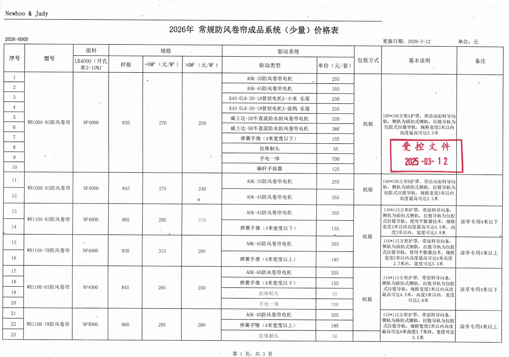
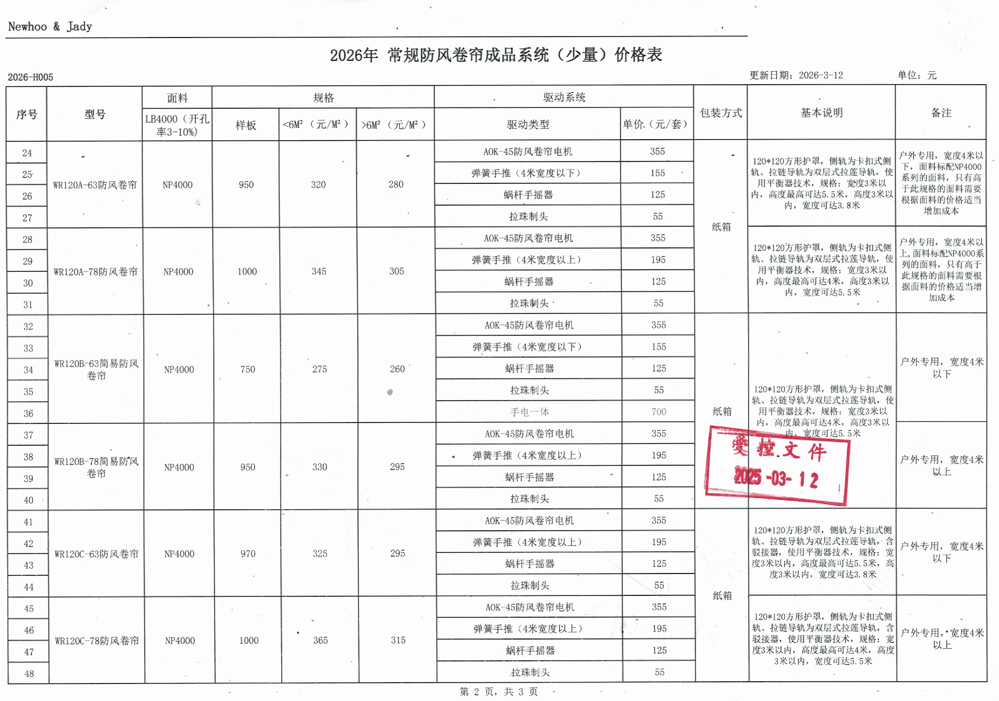
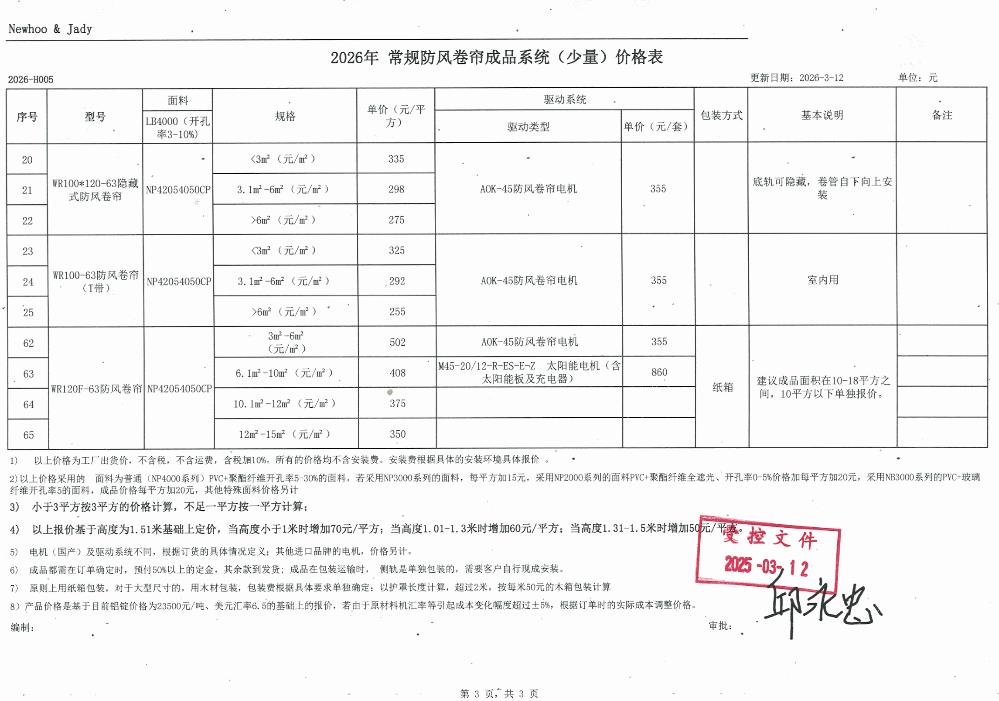

# Nestopia 防风卷帘定价策略与技巧分析

> **文件编号**: 2026-H005  
> **源文件**: 常规防风卷帘成品（少量）报价表（2026.3.12 更新版）  
> **出品方**: Newhoo & Jady  
> **分析版本**: v1.0.0 — 2026-03-26  
> **状态**: 内部受控文件 — 仅限经销商及内部团队使用

---

## 目录

1. [原始报价表](#1-原始报价表2026-h005)
2. [报价表结构解读](#2-报价表结构解读)
3. [产品型号与定价总览](#3-产品型号与定价总览)
4. [驱动系统选项与定价](#4-驱动系统选项与定价)
5. [定价策略深度分析](#5-定价策略深度分析)
6. [定价技巧与商业洞察](#6-定价技巧与商业洞察)
7. [经销商应用指南](#7-经销商应用指南)
8. [附录](#8-附录)

---

## 1. 原始报价表（2026-H005）

以下为 2026-H005 报价表原件扫描件（共3页），加盖「受控文件 2025-03-12」印章。

### 第 1 页 — 常规系列（WR1006 ~ WR1108）



### 第 2 页 — 常规系列续（WR1204 ~ WR125C）



### 第 3 页 — 隐藏式系列 & 太阳能系列 + 备注条款



---

## 2. 报价表结构解读

### 2.1 表头字段定义

| 列名 | 含义 | 说明 |
|------|------|------|
| **序号** | 行号 | 产品条目编号 |
| **型号** | 产品型号 | 如 WR1006-65、WR1208-75 等 |
| **面料** | 面料型号 | LB4000（开孔率 3%–10%），NP4000/6000/8000 系列 |
| **样板** | 样板单价（元） | 用于客户选样，价格远高于批量单价 |
| **<5㎡（元/㎡）** | 小面积单价 | 面积小于 5㎡ 时的每平米价格 |
| **≥5㎡（元/㎡）** | 大面积单价 | 面积达到 5㎡ 以上时的每平米价格 |
| **驱动类型** | 驱动系统名称 | 电机型号或手动驱动类型 |
| **单价（元/套）** | 驱动系统套价 | 每套驱动系统的独立报价 |
| **包装方式** | 包装规格 | 纸箱等 |
| **基本说明** | 产品说明 | 尺寸规格、防护罩参数、安装要求 |
| **备注** | 补充事项 | 特殊工艺、适用场景等 |

### 2.2 定价公式

```
客户总价 = 面料单价(元/㎡) × 实际面积(㎡) + 驱动系统单价(元/套)
```

> **注意**: 面积不足 1㎡ 按 1㎡ 计算；帘下高度偏离 1.51m 基准时需加收附加费。

---

## 3. 产品型号与定价总览

### 3.1 常规防风卷帘（第1-2页）

| 型号 | 面料 | 样板价(元) | <5㎡(元/㎡) | ≥5㎡(元/㎡) | 管径 | 适用场景 |
|------|------|-----------|-------------|-------------|------|---------|
| WR1006-65 | NP4000 | 820 | 270 | — | 65mm | 入门款，100×100防护罩 |
| WR1008-65 | NP4000 | 845 | 273 | 240 | 65mm | 100×100防护罩，铝型壳固定 |
| WR1104-65 | NP4000 | 865 | 296 | 270 | 65mm | 110×111防护罩 |
| WR1104-75 | NP4000 | 900 | 313 | — | 75mm | 110×111防护罩，≥4m宽 |
| WR1106-65 | NP4000 | 845 | 260 | 250 | 65mm | 110×115防护罩 |
| WR1108-75 | NP4000 | 900 | 295 | 290 | 75mm | 110×115防护罩 |
| WR1204-65 | NP4000 | 900 | 320 | — | 65mm | 120×120防护罩，户外专用 |
| WR1204-75 | NP6000 | 1,000 | 345 | 305 | 75mm | 120×120防护罩，高端系列 |
| WR1208-65 隐蔽式 | NP8000 | 750 | 273 | 250 | 65mm | 户外隐蔽安装 |
| WR1208-75 隐蔽式 | NP6000 | 800 | 338 | 298 | 75mm | 户外隐蔽安装 |
| WR150C-65 | NP6000 | 670 | 315 | — | 65mm | 120×120防护罩 |
| WR125C-75 | NP4000 | — | 365 | — | 75mm | 高端定制 |

### 3.2 隐藏式防风卷帘（第3页）

| 型号 | 面料 | <3㎡(元/㎡) | 3.1–6㎡(元/㎡) | >6㎡(元/㎡) | 驱动标配 | 驱动价(元/套) |
|------|------|------------|---------------|------------|---------|-------------|
| WR100×120-65 隐藏式 | NP4205/4500CP | 335 | 298 | 275 | AOK-45 | 298 |
| WR100-65 | NP4205/4500CP | 325 | 292 | 265 | AOK-45 | 355 |

### 3.3 太阳能驱动系列（第3页）

| 面积段 | 单价(元/㎡) | 驱动类型 | 驱动价(元/套) |
|--------|-----------|---------|-------------|
| 6.1–10㎡ | 902 | 太阳能电机 + 太阳能板及充电器 | 860 |
| 10.1–12㎡ | 375 | MKS-20/12-P-SS-E-Z | 860 |
| >12㎡ | 350 | 同上 | 860 |

> 建议成品面积控制在 **10–18 平方米**，10㎡ 以下需单独报价。

---

## 4. 驱动系统选项与定价

| 驱动类型 | 单价(元/套) | 类别 | 适用范围 |
|----------|-----------|------|---------|
| 拉珠制头 | 55 | 手动 | 基础款 |
| 钢杆手摇器 | 125 | 手动 | 基础手动 |
| 弹簧手摇（<4m宽） | 135 | 手动 | 中小幅面 |
| 弹簧手摇（≥4m宽） | 195 | 手动 | 大幅面 |
| MK-35 防风卷帘电机 | 255 | 电动 | 小型电机 |
| KAS-ELR-20-18 管状电机 | 250 | 电动 | 管状安装 |
| 威士达-20千直流防水电机 | 255–386 | 电动 | 防水场景 |
| AOK-45 防风卷帘电机 | 298–355 | 电动 | 隐藏式标配 |
| MK-45 防风卷帘电机 | 355 | 电动 | **主力电机** |
| 手电一体 | 700 | 混合 | 电动+手动双模 |
| 太阳能电机全套 | 860 | 电动 | 太阳能独立供电 |

**驱动价格跨度**: ¥55 → ¥860（**15.6倍差距**）

---

## 5. 定价策略深度分析

### 5.1 策略一：模块化拆分定价（Modular Pricing）

```
总价 = 面料系统（按㎡计价）+ 驱动系统（按套计价）
```

**核心逻辑**：
- **降低感知价格门槛** — 客户先关注面料单价（260–345元/㎡），觉得"不贵"，驱动费用作为独立选配项另算
- **提高产品灵活性** — 同一面料可搭配不同驱动，满足从最经济到最高端的需求
- **创造升级空间** — 驱动系统从 ¥55 拉珠到 ¥860 太阳能全套，价格带极宽
- **利润重心转移** — 面料是"引流品"，驱动是"利润品"

**对比分析**：如果用一体式报价（面料+驱动打包），客户比价维度只有一个（总价），容易陷入价格战。拆分后，比较变得复杂，竞品对标难度增加。

---

### 5.2 策略二：阶梯式面积定价（Volume-Tiered Pricing）

| 产品线 | 阶梯分档 | 各档价差 | 心理效应 |
|--------|---------|---------|---------|
| **常规系列** | <5㎡ / ≥5㎡ | 降幅 7%–10% | 鼓励凑到5㎡以上 |
| **隐藏式系列** | <3㎡ / 3.1–6㎡ / >6㎡ | 逐级递减 10%–12% | 三级递进，更精细 |
| **太阳能系列** | 6.1–10㎡ / 10.1–12㎡ / >12㎡ | 极大跳降（902→375） | 强烈推动大面积 |

**策略意图**：
- 隐藏式系列设三档，因为其单价更高、面积对总价影响更显著，精细分档可在各段保护利润
- 太阳能系列 6.1–10㎡ 档高达 902元/㎡，而 >10㎡ 骤降至 375元/㎡ — 这是刻意的"**面积跳崖价**"，目的是强力推动客户选择 10㎡ 以上的大面积方案
- 每个阶梯的门槛都经过设计：**3㎡ / 5㎡ / 6㎡ / 10㎡** 各对应一个常见的窗户/阳台面积区间

---

### 5.3 策略三：最低计费门槛（Minimum Charge Floor）

> *小于1平方按1平方的价格计算*

- **成本回收底线** — 不论面积大小，裁剪、包装、物流的固定成本不变
- **隐性客户筛选** — 过滤极小订单，避免不经济的生产任务
- **标准行业惯例** — 窗帘行业通行做法，客户接受度高

---

### 5.4 策略四：非标尺寸附加费（Dimensional Surcharges）

以 **帘下高度 1.51m** 为基准：

| 高度区间 | 加价 | 原因 |
|---------|------|------|
| ≤ 1.0m | +70 元/㎡ | 小尺寸裁切浪费率高 |
| 1.01–1.3m | +附加费 | 低于标准裁切效率 |
| 1.31–1.5m | +附加费 | 接近标准但仍不经济 |

**反直觉定价洞察**：更矮的帘反而更贵 — 因为面料裁切浪费率更高、固定工序成本不变。这向经销商传递了清晰的信号：**小尺寸的成本不低反高，不要拿小单来压价。**

---

### 5.5 策略五：产品线分层定位（Good-Better-Best Tiering）

```
┌──────────────────────────────────────────────────────────────┐
│                    🔺 Best（高端层）                          │
│  WR1208隐蔽式 / 太阳能系列 / NP6000-8000面料                 │
│  75mm管径 / ¥338-902/㎡ + ¥860驱动                           │
│  → 利润引擎，面向高端项目                                     │
├──────────────────────────────────────────────────────────────┤
│                    🔷 Better（标准层）                        │
│  WR1104 / WR1204 系列 / NP4000-6000面料                      │
│  65-75mm管径 / ¥296-345/㎡ + ¥355驱动                        │
│  → 主力走量款，面向大部分项目                                  │
├──────────────────────────────────────────────────────────────┤
│                    🔹 Good（经济层）                          │
│  WR1006 / WR1008 系列 / NP4000面料                           │
│  65mm管径 / ¥260-273/㎡ + ¥255驱动                           │
│  → 入门引流，面向价格敏感客户                                  │
└──────────────────────────────────────────────────────────────┘
```

**层级价差分析**：
- Good → Better 升级：面料 +¥30–70/㎡，驱动 +¥100/套 — **感知差距小，易于说服**
- Better → Best 升级：面料 +¥50–500/㎡，驱动 +¥500/套 — **高利润区间**
- 65mm → 75mm 管径升级通常带来 **¥35–50/㎡** 的溢价

---

### 5.6 策略六：双轨定价体系（Dual Price List）

本文件为 **「少量」** 报价表，暗示存在对应的 **「批量」** 报价表：

| 维度 | 少量报价（本表） | 批量报价（未公开） |
|------|---------------|-----------------|
| 适用场景 | 经销商日常拿货 | 大项目/大客户集中采购 |
| 价格水平 | 标准价（本表所列） | 折扣价（需另行申请） |
| 商务作用 | 公开基准价 | 销售谈判筹码 |

**策略意图**：
- 少量价格是"挂牌价"，给销售人员一个**议价起点**
- 面对大客户可以"申请批量价"来促成交易，让客户感觉获得了**专属优惠**
- 两套价格的差额 = 销售人员的**灵活裁量空间**

---

## 6. 定价技巧与商业洞察

### 6.1 价格锚定与对比效应（Anchoring & Contrast）

| 锚定技巧 | 具体表现 | 心理效应 |
|---------|---------|---------|
| **样板高价锚定** | 样板价 ¥750–1,000，远高于批量㎡单价 | 正式订单单价显得"便宜" |
| **手动 vs 电动对比** | ¥55拉珠 vs ¥355电机 | 电机不是"贵"，而是"值得升级" |
| **手电一体顶部锚定** | ¥700手电一体 vs ¥355纯电机 | 让纯电机显得极为划算 |
| **太阳能顶部锚定** | ¥860太阳能全套 vs ¥355标准电机 | 标准电机变成了"经济之选" |

### 6.2 定价公式速算模板

**经销商快速估价场景**：

```
场景A: 3㎡ 标准窗户 + MK-45电机
  = 296元/㎡ × 3㎡ + 355元/套
  = 888 + 355 = ¥1,243

场景B: 8㎡ 阳台门 + MK-45电机
  = 270元/㎡ × 8㎡ + 355元/套
  = 2,160 + 355 = ¥2,515

场景C: 15㎡ 大面积 + 太阳能全套
  = 350元/㎡ × 15㎡ + 860元/套
  = 5,250 + 860 = ¥6,110
```

### 6.3 核心定价哲学

```
┌─────────────────────────────────────────────────────────────┐
│                                                             │
│   整体定价哲学：低门槛入场 + 模块化升级获利                    │
│                                                             │
│   入场价（面料单价）  → 感知友好，容易成交                     │
│   利润区（驱动升级）  → ¥55→¥860，15.6倍升级空间              │
│   促量机制（阶梯折扣）→ 面积越大越便宜，推动大单               │
│   成本防线（最低1㎡）  → 保护生产成本底线                      │
│   弹性区间（少量/批量）→ 保留议价空间                          │
│                                                             │
│   一句话：面料引流、驱动盈利、阶梯促量、双表控价                │
│                                                             │
└─────────────────────────────────────────────────────────────┘
```

---

## 7. 经销商应用指南

### 7.1 报价流程建议

```
Step 1: 确认客户需求
  ↓ 测量面积（㎡）、确认安装环境（室内/户外/隐蔽）
Step 2: 选择产品型号
  ↓ 根据面积和安装方式，确定 WR 型号和管径（65/75mm）
Step 3: 确定驱动方式
  ↓ 根据预算和需求，从手动(¥55) → 电动(¥255-355) → 太阳能(¥860) 推荐
Step 4: 计算面料费用
  ↓ 查阅面积阶梯，套用对应单价 × 面积
Step 5: 汇总报价
  ↓ 面料费 + 驱动费 = 出厂价（不含税、运费、安装）
Step 6: 加算附加费（如适用）
  ↓ 非标高度附加费、运费、税费、安装费
```

### 7.2 向上销售话术要点

| 升级方向 | 推荐话术 | 加价幅度 |
|---------|---------|---------|
| 65mm → 75mm 管径 | "75mm管径抗风性能更强，适合户外和大面积" | +¥35–50/㎡ |
| 手动 → 电动 | "每天使用电动更方便，一次投入长期受益" | +¥200–300/套 |
| 标准电机 → 手电一体 | "停电也能手动操作，双重保障" | +¥345/套 |
| 标准 → 太阳能 | "零电费、无需布线，阳台/户外最佳方案" | +¥505/套 |
| NP4000 → NP6000 | "更高品质面料，耐候性更强" | 需查对应型号 |

### 7.3 注意事项

1. **报价不含税、不含运费** — 含配件（不含手拉珠），安装费及螺丝等安装配件另计
2. **面料基准为 NP4000 系列** — 面积为实际安装帘布面积
3. **标准2200面宽需裁剪** — 有接缝的帘宽按展开面积的实际宽度×高度计算
4. **不足1㎡按1㎡计算**
5. **帘下高度基准 1.51m** — 偏离基准需加收附加费
6. **机密条款** — 内部成本结构严禁向终端客户透露

---

## 8. 附录

### 8.1 型号命名规则

```
WR  1108  -  75
│    │       │
│    │       └── 卷管直径：65mm / 75mm
│    └────────── 导轨规格代码（越大=越大的导轨截面）
└─────────────── Wind Resistant（防风）
```

**后缀**:
- 无后缀 = 常规安装
- `隐蔽式` = 隐蔽安装方式
- `C` 后缀（如 WR150C）= 特定系列变体

### 8.2 面料型号对照

| 面料代码 | 等级 | 典型应用 |
|---------|------|---------|
| NP4000 | 标准 | 常规系列标配 |
| NP4205/4500CP | 标准+ | 隐藏式系列标配 |
| NP6000 | 高端 | 大尺寸/户外系列 |
| NP8000 | 旗舰 | 隐蔽式高端型号 |
| LB4000 | 通用 | 开孔率 3%–10% |

### 8.3 关联文件

| 文件编号 | 文件名 | 说明 |
|---------|--------|------|
| 2026-H004 | 超宽、超高系列防风卷帘成品价格表 | 非标/大尺寸价格 |
| 2026-H005 | 常规防风卷帘成品（少量）报价表 | **本文件** |

---

> **文档维护**: 本文件随价格表更新同步维护。任何价格调整需重新分析策略影响。  
> **机密等级**: 经销商机密 — 禁止向终端消费者或竞争对手披露
