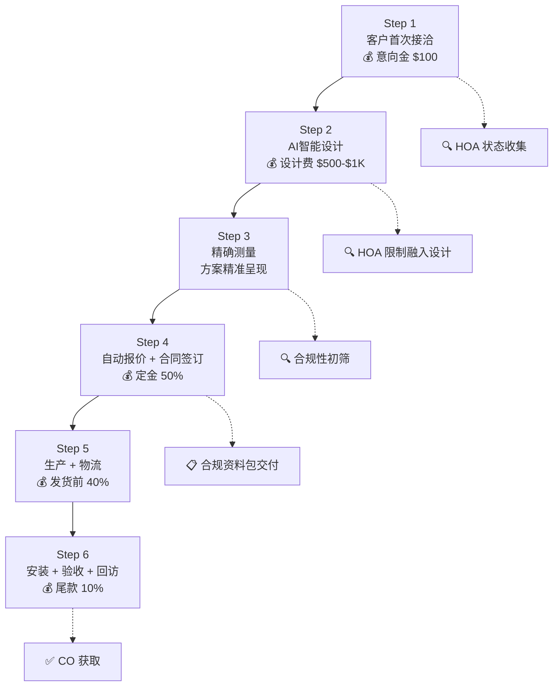

# Nestopia 业务流程文档 (Business Workflow Specification)

> **来源**：移动阳光房标准化全流程工作流（六步法）+ Roy 业务流程图 20260309  
> **版本**：v2.0  
> **日期**：2026-03-14  
> **适用产品**：Retractable Sunroom（移动阳光房）、Pergola（凉亭）  
> **未来扩展**：ADU、Zip Blinds

---

## 一、流程概览 (Overview)

### 1.1 六步法总览

整个业务流程采用**六步法**，覆盖从客户首次接洽到竣工验收的完整生命周期：

| 步骤 | 名称 | 核心目标 | 付款节点 |
|------|------|---------|---------|
| **Step 1** | 客户首次接洽，意向需求初探 | 唤醒"向往"，建立信任，筛选高意向客户 | 1st: 意向金 $100 |
| **Step 2** | AI智能设计，概念快速聚焦 | 强化"渴望"，推动进入正式设计 | 2nd: 设计费 $500-$1,000 |
| **Step 3** | 精确测量，方案精准呈现 | 用精确数据锁定设计，消除安装偏差 | — |
| **Step 4** | 自动报价生成，正式合同签订 | 透明高效完成商务环节，启动合规流程 | 3rd: 定金（合同50%） |
| **Step 5** | 生产制作加工，物流运输到货 | 高效生产，精准交付 | 发货前付款（合同40%） |
| **Step 6** | 现场安装指导，竣工验收回访 | 确保安装质量，完成合规闭环 | 4th: 尾款（合同10%） |

### 1.2 客户心理节奏

```
意向金唤醒"向往" → 设计费强化"渴望" → 定金锁定承诺 → 尾款交付满意
```

### 1.3 合规前置策略

<mark>**合规贯穿全流程**</mark>：从第一步到第六步，HOA 和政府许可要求持续融入，避免后期风险。

| 步骤 | 合规动作 |
|------|---------|
| Step 1 | 主动询问 HOA 状态，收集社区信息 |
| Step 2 | 概念图融入 HOA 常见限制（屋顶坡度、颜色、材料） |
| Step 3 | 合规性初筛（退界距离、排水坡度、邻居边界） |
| Step 4 | 交付完整合规资料包（图纸、结构计算书、产品规格） |
| Step 5 | 材料符合美国标准（ASTM） |
| Step 6 | 政府最终检查 → 获取 CO（Certificate of Occupancy） |

### 1.4 流程图



---

## 二、Step 1：客户首次接洽，意向需求初探

### 2.1 核心目标

<mark>**唤醒客户对理想户外生活方式的"向往"，建立信任，筛选高意向客户**</mark>

### 2.2 核心动作

| # | 动作 | 详细说明 |
|---|------|---------|
| 1 | **多渠道获客** | 筛选适合的流媒体进行矩阵式分发；与当地建商、设计师、中介机构等合作 |
| 2 | **初次沟通** | 电话/视频/见面，15-20分钟快速了解基本需求（使用场景、位置、功能、预算范围） |
| 3 | **产品演示** | <mark>**重点展示 Before-After-Animation**</mark>，让客户直观看到"旧庭院→新阳光房/凉亭"的转变，激发兴趣 |
| 4 | **深度洞察** | 了解客户的想法、顾虑、期望的生活方式，记录在 **Client Design Intake Questionnaire** 中 |
| 5 | **合规预沟通** | 主动询问社区/HOA 情况，告知可能的审查要求（外观一致性、退界、高度限制等），帮助客户提前了解合规门槛 |
| 6 | **收取意向金** | **$100**（可抵合同款，1st payment），锁定客户意向 |

### 2.3 关键产出

**Client Design Intake Questionnaire（客户设计需求表）**：
- 场景分类（阳光房/凉亭）
- 安装位置
- 功能用途
- 是否靠墙
- 期望尺寸
- 预算范围
- HOA 状态
- 社区名称（用于查询 HOA 规定）

### 2.4 美国市场注意事项

- 意向金在高端定制服务中常见，但需明确退款政策
- 此时应收集客户社区信息，以便提前查询 HOA 限制（如有公开的 HOA 设计指南）
- 初次沟通即强调合规重要性，可避免后续因 HOA 拒绝导致的失望

### 2.5 AI Agent 支持

| Agent | 支持能力 |
|-------|---------|
| **CS Agent** | 7×24 自动回复咨询，预约上门/视频时间 |
| **Knowledge Base** | 提供 HOA 常见问题参考、产品 FAQ |
| **Compliance Agent** | 根据社区名称初步查询 HOA 限制 |

---

## 三、Step 2：AI智能设计，概念快速聚焦

### 3.1 核心目标

<mark>**帮助客户快速看到"可能性"，强化拥有产品的"渴望"，推动进入正式设计**</mark>

### 3.2 核心动作

| # | 动作 | 详细说明 |
|---|------|---------|
| 1 | **资料收集** | 客户支付意向金后，引导上传场地实景照片（要求：多角度、带参照物、清晰显示周边环境），并提供房屋平面图（如有） |
| 2 | **产品选型** | 客户在 AI Design 模块中选择 2-3 个偏好款式（与产品矩阵对应：如单坡顶、多坡顶、弧形顶等），系统基于初步需求推荐 |
| 3 | **AI 生成概念图** | <mark>**系统自动将选定产品模型与客户上传的实景照片融合**</mark>，生成特定角度的概念效果图（2-3 个角度），突出产品在场景中的视觉效果 |
| 4 | **方案讲解** | 销售顾问与客户远程/当面解读概念图，讨论方案的可行性、风格匹配度，并解答疑问 |
| 5 | **收取设计费** | **$500-$1,000**（2nd payment，可抵合同款），进入精准设计环节。金额根据项目复杂度和客户预算灵活确定，"若因我方原因无法推进，可全额退还" |

### 3.3 关键产出

**Photorealistic Concept Design（实景融合概念效果图）**：
- 至少 2 个方案
- 每个方案含 2-3 个角度
- 标注产品型号和基本尺寸

### 3.4 美国市场注意事项

- 概念图阶段即融入 **HOA 常见限制**（如屋顶坡度、颜色、材料反射率），避免后续合规冲突
- 例如，若 HOA 规定屋顶坡度不得大于 4:12，则自动过滤不符合的款式
- 设计费收取后，客户进入深度参与阶段，此时应提供更详细的产品信息手册

### 3.5 AI Agent 支持

| Agent | 支持能力 |
|-------|---------|
| **AI Designer** | <mark>**核心：实景照片 + 产品模型 → 30秒生成概念效果图**</mark> |
| **Compliance Agent** | 自动过滤不符合 HOA 限制的产品款式 |
| **Knowledge Base** | 提供产品规格、风格参考 |

---

## 四、Step 3：精确测量，方案精准呈现

### 4.1 核心目标

<mark>**用精确数据锁定设计，彻底消除现场安装偏差风险**</mark>，同时为客户创造附加价值（数字资产）

### 4.2 核心动作

| # | 动作 | 详细说明 |
|---|------|---------|
| 1 | **预约现场测量** | 与客户约定时间，发送测量前准备指南（清理场地、确认水电位置、标记障碍物） |
| 2 | **现场精确测量** | 专业人员上门，使用专业测量工具进行精确测量。扫描范围包括安装区域及周边必要结构（墙体、地面、屋檐） |
| 3 | **结构评估** | 分析墙体承重、地基状况、与主屋连接点的结构可行性，出具初步评估建议 |
| 4 | **障碍物精确定位** | 记录所有管道、烟道、通风口、水电接口、地下设施（化粪池、排水管）的精确位置 |
| 5 | **合规性初筛** | 基于精确位置复核退界距离、排水坡度、与邻居边界距离等是否符合当地法规 |
| 6 | **深化设计** | 基于测量数据，将客户选定的标准/半标/非标产品模型嵌入场景，生成任意角度的实景融合方案效果图 + 总平面规划图（Site Plan）|
| 7 | **方案呈现** | 向客户展示精准方案，确认所有细节（外观、内部布局、与现有建筑的衔接方式） |

> **🔮 近期规划：激光三维扫描能力**
> 
> 我们正在引入激光三维扫描技术（UNRE / Leica），将实现毫米级精度的现场扫描。未来能力包括：
> - **基础版**：仅扫描安装区域及周边必要结构
> - **增值版**：全场景扫描，为客户提供完整点云模型数字资产（可额外收费）
> - 扫描数据可作为许可申请的有力支撑
> 
> *此能力将在后续版本中实现，当前以专业人工测量为主。*

### 4.3 关键产出

| 产出物 | 说明 |
|--------|------|
| **总平面规划图（Site Plan）** | 含尺寸标注、退界距离、与主屋关系 |
| **任意角度实景融合方案效果图** | 至少 5-8 个角度，可含白天/夜晚不同光照效果 |
| **结构评估建议** | 如有必要 |
| **合规性指引文件** | 列出需满足的当地法规要点及下一步许可申请注意事项 |

### 4.4 美国市场注意事项

- 精确测量数据可作为许可申请的有力支撑
- 合规性指引文件中应明确列出需要向 HOA 和市政提交的材料清单
- 此时应与客户确认是否有地下化粪池、雨水管理设施等，影响基础设计和许可审批

### 4.5 AI Agent 支持

| Agent | 支持能力 |
|-------|---------|
| **AI Designer** | 基于测量数据生成精准效果图 + Site Plan |
| **Compliance Agent** | 自动复核退界距离、法规合规性 |
| **Knowledge Base** | 提供区域法规参考、结构标准 |

---

## 五、Step 4：自动报价生成，正式合同签订

### 5.1 核心目标

<mark>**透明高效完成商务环节，锁定项目，启动合规流程**</mark>

### 5.2 核心动作

| # | 动作 | 详细说明 |
|---|------|---------|
| 1 | **方案确认** | 客户对 Step 3 的方案效果图、总平面图签字确认，作为报价和合同的基础 |
| 2 | **产品选配** | 引导客户完成个性化配置：外观喷涂颜色（RAL色号）、遮阳帘（电动/手动）、启闭模式（手动/电动/智能控制）、智能化控制模组、光伏与储能模组、其他选配项（照明、地暖、空调、音响等） |
| 3 | **自动报价** | <mark>**系统根据配置自动生成详细报价单**</mark>：基础配置价格 + 选配项价格 + 人工费 + 许可代办费（可选）+ 税费 + 总价及支付计划 |
| 4 | **报价解读** | 销售顾问逐项解释，回答客户疑问，确保客户理解每一项费用 |
| 5 | **合同生成** | 系统根据报价和方案自动生成正式合同 |
| 6 | **合同签署** | 客户线上或线下签署合同 |
| 7 | **收取定金** | **合同总额的 50%**（3rd payment），启动材料采购和许可申请 |
| 8 | **交付合规资料** | 向客户提供符合项目所在地合规审批要求的完整资料包 |

### 5.3 合同关键条款

| 条款 | 内容 |
|------|------|
| 项目总价与支付节点 | 50% 定金 → 40% 发货前 → 10% 尾款 |
| 许可责任方 | 通常由承包商代办，费用包含在总价或单独列出 |
| 工期预估 | 许可阶段 3-6 周 + 生产 4-8 周 + 安装 1-2 周 |
| 变更订单流程 | 流程与费用说明 |
| 质保条款 | 1 年工质保，5-10 年材料质保 |
| 许可前提 | **许可获批是开工前提**，约定若许可被拒的退款/变更条款 |

### 5.4 合规资料包

- 产品规格说明书
- 总平面图
- 产品平面图
- 产品立面图
- 家具布置图（可选）
- 铺装建议图（可选）
- 结构计算书（需持牌工程师签字盖章）
- 基础平面图标准图集选型建议

### 5.5 AI Agent 支持

| Agent | 支持能力 |
|-------|---------|
| **Pricing Agent** | <mark>**核心：自动生成详细报价单，含所有隐性成本**</mark> |
| **Compliance Agent** | 自动生成合规资料包 |
| **AI Designer** | 导出方案图纸 |

---

## 六、Step 5：生产制作加工，物流运输到货

### 6.1 核心目标

**高效生产，精准交付，确保现场安装无缝衔接**

### 6.2 核心动作

| # | 动作 | 详细说明 |
|---|------|---------|
| 1 | **生产排程** | 订单进入工厂，生成唯一项目编号，排入生产计划（通常 4-8 周，视复杂度） |
| 2 | **材料采购** | 按 BOM 清单采购玻璃/聚碳酸酯板、铝材、五金、电机等，所有材料符合美国标准（ASTM） |
| 3 | **生产过程跟踪** | 客户可通过系统查看生产进度（关键节点照片/视频更新：型材切割、框架组装、玻璃安装） |
| 4 | **出厂质检** | 完成生产后进行预组装，核对所有尺寸、孔位、配件，确保与设计图纸一致。进行功能测试（电机、密封性） |
| 5 | **包装与标签** | 每个组件独立包装，贴标签标明安装位置（如"北墙左一立柱"），并附安装示意图。易碎品加贴警示标识 |
| 6 | **物流发运** | 预约货运公司（考虑超大件运输），发送跟踪号给客户。确认目的地卸货条件（是否需要叉车、吊车） |
| 7 | **到货确认** | 客户签收，核对箱数，检查外包装有无破损。如有损坏，拍照记录 |

### 6.3 关键产出

| 产出物 | 说明 |
|--------|------|
| 生产进度报告 | 含照片/视频 |
| 出厂质检报告 | 含预组装照片 |
| 物流跟踪信息 | 实时跟踪 |
| 到货签收单 | 客户签字 |

### 6.4 美国市场注意事项

- 物流需考虑美国各州运输法规，超大件可能需要特别许可或 escort
- 提前与客户确认卸货条件（driveway 限制、是否需要吊车）
- 出厂质检报告应包含预组装照片，作为后续安装参考

---

## 七、Step 6：现场安装指导，竣工验收回访

### 7.1 核心目标

<mark>**确保安装质量，完成合规闭环，创造满意客户与转介绍**</mark>

### 7.2 核心动作

| # | 动作 | 详细说明 |
|---|------|---------|
| 1 | **安装前准备** | 确认基础施工完成且通过政府基础检查；确认水电点位已按图纸预留；确认材料已到场且无损坏 |
| 2 | **现场安装** | 专业安装团队按图纸和标签位置组装（通常 3-7 天）。每日拍照记录，项目经理节点验收 |
| 3 | **政府最终检查** | 安装完成后预约当地建筑部门进行最终检查，提供所有要求的文件。<mark>**检查通过后获得 CO（Certificate of Occupancy）**</mark> |
| 4 | **客户最终验收** | 陪同客户逐项检查：外观（颜色、表面、密封性）、功能（启闭、电机、灯光、智能控制）、清理（现场清理干净） |
| 5 | **尾款收取** | CO 获批且客户验收合格后，收取剩余 **10% 尾款**（4th payment） |
| 6 | **资料移交** | 保修卡、使用手册、CO 副本、所有检查报告、第三方产品保修文件 |
| 7 | **客户回访** | 安装后 1 个月电话回访；6 个月发送维护提醒；1 年上门免费检查（可选增值服务） |
| 8 | **推荐计划** | 邀请客户撰写在线评价（Google、HOUZZ、Angi），启动推荐奖励（返现、服务抵扣） |

### 7.3 关键产出

| 产出物 | 说明 |
|--------|------|
| 安装过程照片/视频 | 存档 |
| **政府最终检查通过文件（CO）** | 合法使用的法律凭证 |
| 客户验收签字单 | 明确列出所有检查项目 |
| 尾款支付凭证 | — |
| 质保文件与使用手册 | — |
| 客户评价与推荐记录 | — |

### 7.4 美国市场注意事项

- **CO 是合法使用的法律凭证**，必须在尾款支付前获取，保护双方权益
- 若检查未通过，我方负责整改直至通过
- 安装团队需持有相应执照（如电工证），并购买责任保险
- 回访和推荐计划是美国服务行业建立口碑的关键，应系统化执行

### 7.5 AI Agent 支持

| Agent | 支持能力 |
|-------|---------|
| **CS Agent** | 自动安排回访提醒、满意度调查、推荐邀请 |
| **Compliance Agent** | 准备政府检查所需文件清单 |

---

## 八、支付节点汇总 (Payment Milestones)

| 支付节点 | 金额 | 时机 | 说明 |
|---------|------|------|------|
| **1st — 意向金** | $100 | Step 1：客户首次接洽后 | 可抵合同款，锁定意向 |
| **2nd — 设计费** | $500-$1,000 | Step 2：AI 概念设计后 | 可抵合同款，进入精准设计 |
| **3rd — 定金** | 合同总额 50% | Step 4：合同签订时 | 启动材料采购和许可申请 |
| **发货前付款** | 合同总额 40% | Step 5：生产完成发货前 | 确认发货 |
| **4th — 尾款** | 合同总额 10% | Step 6：CO 获批 + 客户验收后 | 项目完结 |

---

## 九、美国市场全流程关键节点与责任矩阵

| 阶段 | 主要责任方 | 客户参与点 | 关键风险控制 | AI Agent 支持 |
|------|-----------|-----------|-------------|--------------|
| **Step 1** | 销售 | 填写问卷、支付意向金 | 客户意向真实度筛选 | CS Agent + Compliance Agent |
| **Step 2** | 销售/AI系统 | 上传照片、选型、支付设计费 | 概念图是否符合客户预期 | **AI Designer** (核心) |
| **Step 3** | 测量师/设计师 | 现场配合、确认方案 | 测量数据准确性、合规性初筛 | AI Designer + Compliance Agent |
| **Step 4** | 销售/客户 | 选配、签字、支付定金 | 合同条款清晰、许可责任明确 | **Pricing Agent** (核心) + Compliance Agent |
| **Step 5** | 工厂/物流 | 收货确认 | 生产质量、物流损坏 | — |
| **Step 6** | 安装团队/项目经理 | 验收、支付尾款 | 政府检查通过、客户满意 | CS Agent + Compliance Agent |

---

## 十、六步法核心优势总结

1. <mark>**客户心理节奏匹配**</mark>：意向金唤醒"向往"，设计费强化"渴望"，定金锁定承诺，尾款交付满意
2. <mark>**合规前置**</mark>：从第一步到第六步持续融入 HOA 和政府许可要求，避免后期风险
3. <mark>**数字化赋能**</mark>：AI 概念图快速激发兴趣，精准测量精确设计，自动报价高效透明
4. **权责清晰**：每个阶段有明确产出和支付节点，保护双方权益
5. **品牌积累**：通过专业流程和回访推荐，逐步建立市场口碑

---

## 十一、网站需支持的核心功能 (Required Website Features)

> *保留自 v1.0，与六步法对齐*

### 11.1 信息收集模块（Step 1）
- 在线咨询表单（收集客户基本需求）
- 照片上传功能（客户上传现场照片）
- 产品品类选择（Sunroom / Pergola）
- Client Design Intake Questionnaire

### 11.2 产品展示模块（Step 1-2）
- 产品 3D 动画/视频展示（Before-After-Animation）
- 各品类产品详情（与产品矩阵对应）
- 应用场景展示

### 11.3 AI 设计工具模块（Step 2-3）
- 实景融合工具（上传照片 + 选择产品 → AI 生成效果图）
- 产品选型推荐
- 设计方案生成与展示
- 方案在线查看/下载/导出 PDF

### 11.4 报价与合同模块（Step 4）
- 产品配置器（颜色、材质、选配项）
- 自动报价生成
- 合同模板生成
- 电子签署（未来）

### 11.5 项目追踪模块（Step 5-6）
- 生产进度可视化
- 物流跟踪
- 安装进度记录
- 政府检查状态追踪
- 客户验收管理

### 11.6 客户关系模块（Step 6+）
- 回访提醒系统
- 满意度调查
- 推荐计划管理
- 在线评价引导

---

## 十二、变更日志

| 版本 | 日期 | 变更内容 |
|------|------|---------|
| 1.0 | 2026-03-09 | 初始版本 — 基于 Roy 业务流程图的 16 步流程（2 Phase） |
| **2.0** | **2026-03-14** | **重大重构**：采用六步法替代 16 步流程；新增 5 个付款节点（含意向金 $100）；全流程融入合规前置策略（HOA + 政府许可）；新增激光三维扫描规划（占位）；增加 AI Agent 支持映射；新增责任矩阵；适用产品：Sunroom + Pergola |

---

*本文档基于"移动阳光房标准化全流程工作流（六步法）"和 Roy 业务流程图整合优化，作为网站功能开发和 B 端项目管理的需求来源。*
