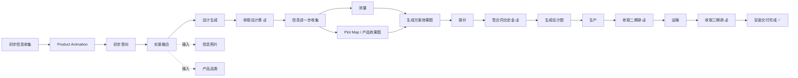

# Nestopia 业务流程文档 (Business Workflow Specification)

> 来源：业务流程图 20260309 from Roy
> 版本：v1.0
> 日期：2026-03-09

---

## 一、流程概览 (Overview)

整个业务流程分为两个主要阶段：

| 阶段 | 名称 | 目标 | 付费节点 |
|------|------|------|----------|
| Phase 1 | 售前设计阶段 | 通过AI工具快速生成设计方案，获取客户意向 | 设计费 |
| Phase 2 | 交付实施阶段 | 从精确测量到安装完成的全流程交付 | 定金 → 二期款 → 三期款 |

---

## 二、Phase 1 — 售前设计阶段 (Pre-Sale Design)

### Step 1: 初步信息收集 (Initial Information Collection)
- **触发条件**：客户通过网站、社交媒体或线下渠道发起咨询
- **收集内容**：
  - 客户基本需求（阳光房/凉亭/防风卷帘等）
  - 现场照片（信息照片）
  - 大致尺寸和偏好
  - 联系方式
- **输出**：客户需求档案

### Step 2: Product Animation (产品动画展示)
- **目标**：通过3D产品动画向客户展示各品类产品的外观、功能和效果
- **内容**：
  - 阳光房 (Sun Room) 动画展示
  - 凉亭 (Pavilion) 动画展示
  - 防风卷帘 (Windproof Roller Shutter) 动画展示
- **工具**：网站内置产品动画/视频播放器
- **输出**：客户对产品品类的初步了解

### Step 3: 初步意向 (Preliminary Intent)
- **触发条件**：客户观看产品动画后表达兴趣
- **内容**：
  - 确认感兴趣的产品品类
  - 进一步沟通需求细节
- **输出**：明确的产品品类选择 + 客户意向确认

### Step 4: 实景融合 (Real Scene Integration)
- **核心功能**：将客户提供的实景照片与选定产品进行AI融合
- **输入**：
  - 信息照片（客户现场/庭院照片）
  - 产品品类（阳光房/凉亭/防风卷帘）
- **处理过程**：AI将产品模型融入客户实际环境照片
- **输出**：实景融合效果图（让客户直观看到产品安装后的效果）

### Step 5: 设计生成 (Design Generation)
- **目标**：基于实景融合结果，生成完整的初步设计方案
- **内容**：
  - 多角度效果图
  - 材质和颜色建议
  - 初步尺寸方案
- **输出**：设计方案包（PDF/在线查看）

### Step 6: 收取设计费 (Collect Design Fee) 💰
- **付费节点 #1**
- **触发条件**：客户认可设计方案
- **内容**：收取设计服务费用
- **意义**：标志着从售前进入交付阶段的转折点

---

## 三、Phase 2 — 交付实施阶段 (Delivery & Implementation)

### Step 7: 信息进一步收集 (Further Information Collection)
- **目标**：获取精确的施工所需数据
- **并行任务**：
  - **测量 (Measurement)**：专业人员上门精确测量场地尺寸
  - **Plot Map + 产品效果图**：获取地块图和精确产品效果图
- **输出**：精确的场地数据 + 地块信息

### Step 8: 生成方案效果图 (Generate Solution Rendering)
- **目标**：基于精确测量数据，生成最终方案效果图
- **内容**：
  - 精确尺寸的3D效果图
  - 结构方案可视化
  - 材料清单预览
- **输出**：最终方案效果图

### Step 9: 报价 (Quotation)
- **目标**：基于最终方案生成详细报价
- **内容**：
  - 材料费用明细
  - 人工费用
  - 运输费用
  - 安装费用
  - 总价及付款计划
- **输出**：正式报价单

### Step 10: 签合同交定金 (Sign Contract & Pay Deposit) 💰
- **付费节点 #2**
- **内容**：
  - 签署正式合同
  - 客户支付定金
- **输出**：正式合同 + 定金到账

### Step 11: 生成设计图 (Generate Design/Engineering Drawings)
- **目标**：生成生产和施工所需的技术图纸
- **内容**：
  - 结构工程图
  - 安装施工图
  - 材料切割图
- **输出**：完整的技术图纸包

### Step 12: 生产 (Production/Manufacturing)
- **目标**：按照设计图进行生产制造
- **内容**：
  - 材料采购
  - 组件加工制造
  - 质量检测
- **输出**：成品组件

### Step 13: 收取二期款 (Collect 2nd Payment) 💰
- **付费节点 #3**
- **触发条件**：生产完成，准备发货
- **内容**：收取合同约定的第二期款项

### Step 14: 运输 (Shipping/Transportation)
- **目标**：将成品安全运输至客户现场
- **内容**：
  - 包装防护
  - 物流安排
  - 运输跟踪
- **输出**：货物送达客户现场

### Step 15: 收取三期款 (Collect 3rd Payment) 💰
- **付费节点 #4**
- **触发条件**：货物到达现场，准备安装
- **内容**：收取合同约定的第三期款项

### Step 16: 安装交付完成 (Installation & Delivery Complete) ✅
- **目标**：完成现场安装并交付使用
- **内容**：
  - 现场安装施工
  - 质量验收
  - 使用培训
  - 保修说明
- **输出**：客户签收确认

---

## 四、付款节点汇总 (Payment Milestones)

| 节点 | 阶段 | 时机 | 说明 |
|------|------|------|------|
| 设计费 | Phase 1 | 设计方案确认后 | 售前设计服务费 |
| 定金 | Phase 2 | 签合同时 | 合同生效款 |
| 二期款 | Phase 2 | 生产完成时 | 生产完成/发货前 |
| 三期款 | Phase 2 | 到货安装前 | 安装前收取 |

---

## 五、网站需支持的核心功能 (Required Website Features)

### 5.1 信息收集模块
- 在线咨询表单（收集客户基本需求）
- 照片上传功能（客户上传现场照片）
- 产品品类选择

### 5.2 产品展示模块
- 产品3D动画/视频展示
- 各品类产品详情页
- 应用场景展示

### 5.3 AI设计工具模块
- 实景融合工具（上传照片 + 选择产品 → AI生成效果图）
- 设计方案生成与展示
- 方案在线查看/下载

### 5.4 服务流程展示
- 可视化业务流程图
- 各步骤状态追踪（未来扩展）
- 在线客户了解服务全流程

---

## 六、Mermaid 流程图

---

*本文档基于Roy提供的业务流程图整理，作为网站功能开发的需求来源。*
