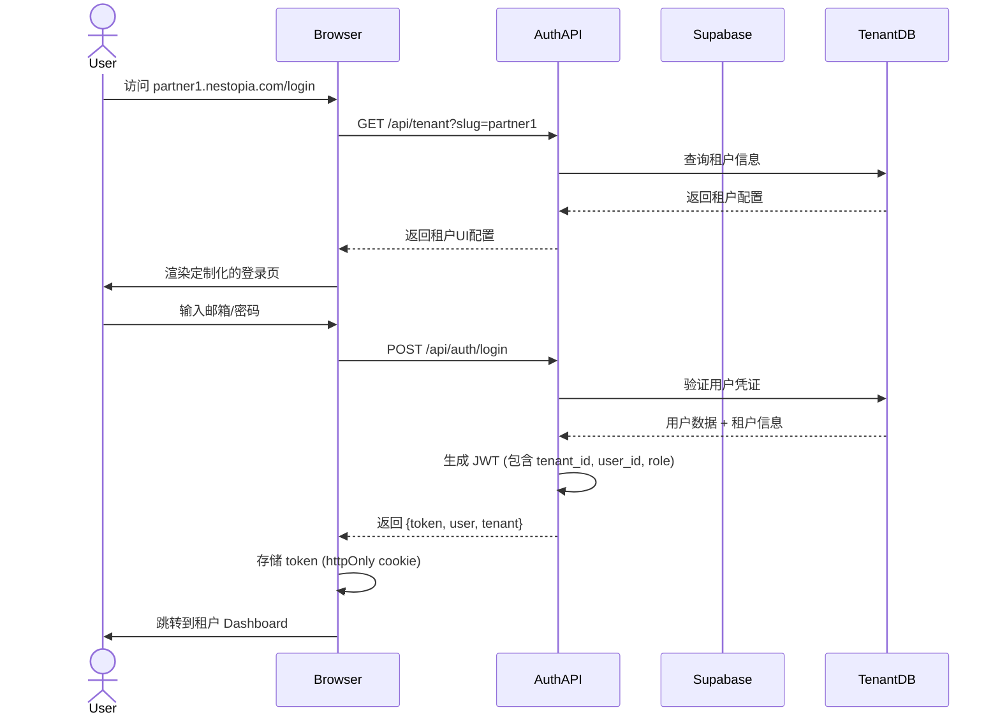

# 多租户系统架构设计 (Multi-Tenant Architecture)

> 版本: v2.0
> 日期: 2026-03-11 (updated)
> 目标: 支持多租户合作伙伴平台，每个租户拥有独立数据和可定制UI
> 
> **数据库Schema**: `supabase/schema.sql` (规范来源) | **详细文档**: `DATABASE_SCHEMA.md`

---

## 一、架构概览

```
┌─────────────────────────────────────────────────────────────────┐
│                        前端层 (Frontend)                         │
├─────────────────────────────────────────────────────────────────┤
│  ┌──────────────┐  ┌──────────────┐  ┌──────────────────────┐  │
│  │  公共网站     │  │  租户登录页   │  │   租户管理后台        │  │
│  │  (index.html)│  │(login.html)  │  │  (dashboard.html)    │  │
│  └──────────────┘  └──────────────┘  └──────────────────────┘  │
└─────────────────────────────────────────────────────────────────┘
                              │
                              ▼
┌─────────────────────────────────────────────────────────────────┐
│                      API 网关层 (API Gateway)                    │
├─────────────────────────────────────────────────────────────────┤
│  • 路由分发 (基于 subdomain/path)                                │
│  • JWT 认证验证                                                  │
│  • 租户上下文注入 (Tenant Context)                                │
│  • 速率限制 / CORS                                               │
└─────────────────────────────────────────────────────────────────┘
                              │
                              ▼
┌─────────────────────────────────────────────────────────────────┐
│                      服务层 (Backend Services)                   │
├─────────────────────────────────────────────────────────────────┤
│  ┌──────────────┐  ┌──────────────┐  ┌──────────────────────┐  │
│  │  认证服务     │  │  租户服务     │  │   业务服务            │  │
│  │  Auth API    │  │  Tenant API  │  │  (Projects/Orders)   │  │
│  └──────────────┘  └──────────────┘  └──────────────────────┘  │
└─────────────────────────────────────────────────────────────────┘
                              │
                              ▼
┌─────────────────────────────────────────────────────────────────┐
│                      数据层 (Data Layer)                         │
├─────────────────────────────────────────────────────────────────┤
│  ┌──────────────────────────────────────────────────────────┐  │
│  │              Supabase PostgreSQL (共享数据库)              │  │
│  │  ┌─────────────┐  ┌─────────────┐  ┌─────────────────┐  │  │
│  │  │ 租户元数据   │  │ 用户表       │  │  租户隔离数据    │  │  │
│  │  │ (tenants)   │  │ (users)     │  │ (RLS 行级安全)  │  │  │
│  │  └─────────────┘  └─────────────┘  └─────────────────┘  │  │
│  └──────────────────────────────────────────────────────────┘  │
└─────────────────────────────────────────────────────────────────┘
```

---

## 二、租户识别策略

### 2.1 识别方式 (Tenant Resolution)

| 方式 | 示例 | 适用场景 |
|------|------|----------|
| **Subdomain** | `partner1.nestopia.com` | 主要方式，品牌化 |
| **Path-based** | `nestopia.com/p/partner1` | 备用方式，简单部署 |
| **Custom Domain** | `partner1.com` | 高级租户，完全定制 |
| **Header** | `X-Tenant-ID: partner1` | API 调用 |

### 2.2 租户上下文 (Tenant Context)

```typescript
interface TenantContext {
  tenantId: string;           // 租户唯一标识
  tenantName: string;         // 显示名称
  slug: string;               // URL slug
  plan: 'basic' | 'pro' | 'enterprise';  // 套餐级别
  features: string[];         // 启用的功能
  uiConfig: UIConfig;         // UI 定制配置
  dbSchema?: string;          // 独立 schema (可选)
}

interface UIConfig {
  primaryColor: string;
  logoUrl: string;
  faviconUrl: string;
  customCss?: string;
  hiddenSections?: string[];
  customSections?: CustomSection[];
}
```

---

## 三、数据库设计

> **完整 Schema 请参考**: `supabase/schema.sql` (规范来源) 和 `DATABASE_SCHEMA.md` (详细文档)

### 3.1 共享数据库 + 行级安全 (RLS) 方案

采用 **Shared Database + Row-Level Security** 方案，所有 18 张表共享一个 PostgreSQL 实例，通过 `tenant_id` 和 RLS 策略实现数据隔离。

#### 完整表清单 (v2.0.0, 2026-03-11 更新)

| # | 表名 | 类型 | tenant_id | 说明 |
|---|------|------|-----------|------|
| A1 | `tenants` | 平台 | — | 租户元数据、UI配置、功能开关、配额 |
| A2 | `users` | 基础 | ✅ | 用户/角色 (super_admin/admin/manager/sales/member) |
| A3 | `user_sessions` | 基础 | ✅ | JWT会话、refresh token、设备信息 |
| A4 | `audit_logs` | 基础 | ✅ | 审计日志 (old/new values) |
| A5 | `system_configs` | 基础 | ✅ | 租户配置 (UNIQUE tenant_id+key) |
| B1 | `partners` | 业务 | ✅ | 合作伙伴/渠道商 |
| B2 | `customers` | 业务 | ✅ | 客户管理 (含场地信息、标签、获客来源) |
| C1 | `product_categories` | 业务 | ✅ | 产品分类 (嵌套) |
| C2 | `products` | 业务 | ✅ | 产品目录 (SKU租户内唯一) |
| C3 | `product_files` | 业务 | ✅ | 产品文件 (图片/CAD/3D/PDF) |
| C4 | `pricing` | 业务 | ✅ | 定价规则 (分层/选项/折扣) |
| C5 | `cost_components` | 业务 | ✅ | 成本构成 (供Pricing Agent使用) |
| D1 | `projects` | 业务 | ✅ | 项目管理 |
| D2 | `designs` | 业务 | ✅ | 设计方案 (AI渲染+合规检查) |
| E1 | `orders` | 业务 | ✅ | 订单 (13状态流转, 3阶段付款) |
| E2 | `order_items` | 业务 | ✅ | 订单明细 (产品快照) |
| E3 | `payments` | 业务 | ✅ | 支付记录 (多阶段付款+退款) |
| F1 | `documents` | 业务 | ✅ | 文档管理 (多态关联) |

#### 复合唯一约束 (租户级唯一)

```sql
UNIQUE(tenant_id, email)            -- users
UNIQUE(tenant_id, customer_number)  -- customers
UNIQUE(tenant_id, sku)              -- products
UNIQUE(tenant_id, order_number)     -- orders
UNIQUE(tenant_id, payment_number)   -- payments
UNIQUE(tenant_id, config_key)       -- system_configs
UNIQUE(tenant_id, product_id, component_name) -- cost_components
```

### 3.2 行级安全策略 (RLS)

所有 18 张表均启用 RLS，统一策略模式：

```sql
-- Helper functions
CREATE FUNCTION get_current_tenant_id() RETURNS UUID ...
CREATE FUNCTION is_super_admin() RETURNS BOOLEAN ...

-- 所有业务表使用统一策略模板
CREATE POLICY rls_{table} ON {table} FOR ALL
    USING (
        tenant_id = get_current_tenant_id()
        OR is_super_admin()
    );

-- 租户上下文由 Edge Function / API 中间件设置
SET LOCAL app.current_tenant_id = '{tenant-uuid}';
SET LOCAL app.current_user_id = '{user-uuid}';
SET LOCAL app.is_super_admin = 'false';
```

---

## 四、认证流程

### 4.1 登录流程



### 4.2 JWT Token 结构

```json
{
  "header": {
    "alg": "HS256",
    "typ": "JWT"
  },
  "payload": {
    "sub": "user-uuid",
    "tenant_id": "tenant-uuid",
    "tenant_slug": "partner1",
    "email": "user@partner1.com",
    "role": "admin",
    "permissions": ["projects.read", "projects.write", "orders.read"],
    "iat": 1709990400,
    "exp": 1710076800
  }
}
```

---

## 五、API 设计

### 5.1 认证相关 API

```typescript
// POST /api/auth/login
interface LoginRequest {
  email: string;
  password: string;
  tenantSlug: string;  // 从 URL 自动提取
}

interface LoginResponse {
  success: boolean;
  token: string;
  refreshToken: string;
  user: {
    id: string;
    email: string;
    firstName: string;
    lastName: string;
    role: string;
    permissions: string[];
  };
  tenant: {
    id: string;
    name: string;
    slug: string;
    uiConfig: UIConfig;
  };
}

// POST /api/auth/logout
interface LogoutRequest {
  token: string;
}

// POST /api/auth/refresh
interface RefreshRequest {
  refreshToken: string;
}

// POST /api/auth/forgot-password
interface ForgotPasswordRequest {
  email: string;
  tenantSlug: string;
}

// POST /api/auth/reset-password
interface ResetPasswordRequest {
  token: string;
  newPassword: string;
}
```

### 5.2 租户管理 API (仅超管)

```typescript
// GET /api/tenants
// POST /api/tenants
interface CreateTenantRequest {
  name: string;
  slug: string;
  contactEmail: string;
  plan: 'basic' | 'pro' | 'enterprise';
}

// GET /api/tenants/:id
// PUT /api/tenants/:id
// DELETE /api/tenants/:id

// PUT /api/tenants/:id/ui-config
interface UpdateUIConfigRequest {
  primaryColor?: string;
  logoUrl?: string;
  faviconUrl?: string;
  customCss?: string;
  hiddenSections?: string[];
}
```

### 5.3 用户管理 API

```typescript
// GET /api/users
// POST /api/users
interface CreateUserRequest {
  email: string;
  firstName: string;
  lastName: string;
  phone?: string;
  role: 'admin' | 'manager' | 'sales' | 'member';
  sendInvite: boolean;
}

// GET /api/users/:id
// PUT /api/users/:id
// DELETE /api/users/:id
```

### 5.4 客户管理 API (tenant-scoped)

```typescript
// GET /api/customers              — 列表 (支持 ?status=active&type=vip&search=)
// POST /api/customers             — 创建客户
interface CreateCustomerRequest {
  name: string;
  phone: string;
  email?: string;
  company?: string;
  wechat?: string;
  province?: string;
  city?: string;
  address?: string;
  siteType?: 'villa' | 'townhouse' | 'apartment' | 'commercial' | 'other';
  siteArea?: number;
  source?: string;
  partnerId?: string;
  assignedSales?: string;
  customerType?: 'standard' | 'vip' | 'enterprise';
  tags?: string[];
}

// GET /api/customers/:id          — 详情 (含统计: 订单数/总消费/项目数)
// PUT /api/customers/:id          — 更新
// DELETE /api/customers/:id       — 软删除
// GET /api/customers/:id/orders   — 客户订单
// GET /api/customers/:id/projects — 客户项目
```

### 5.5 产品管理 API (tenant-scoped)

```typescript
// GET /api/products               — 列表 (支持 ?category=&status=&search=)
// POST /api/products              — 创建产品
interface CreateProductRequest {
  sku: string;
  name: string;
  nameEn?: string;
  categoryId?: string;
  description?: string;
  specs?: Record<string, any>;
  isCustomizable?: boolean;
}

// GET /api/products/:id           — 详情 (含文件列表/定价/成本)
// PUT /api/products/:id           — 更新
// DELETE /api/products/:id        — 软删除

// POST /api/products/:id/files    — 上传文件 (支持: image/pdf/dwg/dxf/skp/obj/step/stl)
// GET /api/products/:id/files     — 文件列表
// DELETE /api/products/:id/files/:fileId — 删除文件
```

### 5.6 定价管理 API (tenant-scoped)

```typescript
// GET /api/pricing                — 列表 (支持 ?productId=&active=true)
// POST /api/pricing               — 创建定价规则
interface CreatePricingRequest {
  productId: string;
  pricingName?: string;
  pricingType?: 'standard' | 'promotional' | 'partner' | 'volume' | 'custom';
  basePrice: number;
  priceUnit?: 'per_sqm' | 'per_unit' | 'per_set' | 'per_linear_m';
  currency?: string;
  areaTiers?: Array<{ minSqm: number; maxSqm: number; multiplier: number; label: string }>;
  optionPrices?: Record<string, { price: number; unit: string; label: string }>;
  discountRules?: Record<string, any>;
  effectiveFrom: string;  // ISO date
  effectiveTo?: string;
}

// PUT /api/pricing/:id            — 更新
// DELETE /api/pricing/:id         — 删除

// GET /api/cost-components?productId=  — 成本构成列表
// POST /api/cost-components       — 创建成本项
// PUT /api/cost-components/:id    — 更新
```

### 5.7 订单管理 API (tenant-scoped)

```typescript
// GET /api/orders                 — 列表 (支持 ?status=&customerId=&dateFrom=&dateTo=)
// POST /api/orders                — 创建订单
interface CreateOrderRequest {
  customerId: string;
  projectId?: string;
  designId?: string;
  items: Array<{
    productId: string;
    quantity: number;
    unitPrice: number;
    customization?: Record<string, any>;
    dimensions?: { widthMm: number; depthMm: number; heightMm: number };
  }>;
  discountAmount?: number;
  discountReason?: string;
  shippingAddress?: Record<string, any>;
  shippingMethod?: string;
  shippingFee?: number;
  installationAddress?: Record<string, any>;
  paymentPlan?: Record<string, any>;
  salesRepId?: string;
  partnerId?: string;
}

// GET /api/orders/:id             — 详情 (含明细/支付记录)
// PUT /api/orders/:id             — 更新
// PUT /api/orders/:id/status      — 状态变更
// DELETE /api/orders/:id          — 软删除

// POST /api/orders/:id/payments   — 创建支付记录
// GET /api/orders/:id/payments    — 支付记录列表
```

---

## 六、前端架构

### 6.1 页面结构

```
/public
├── index.html              # 公共首页
├── login.html              # 租户登录页
├── partners.html           # 合作伙伴介绍页
├── dashboard.html          # 租户管理后台
├── /assets
│   ├── css/
│   ├── js/
│   └── images/
└── /tenant-assets          # 租户上传的资源
    ├── /partner1
    │   ├── logo.png
    │   └── custom.css
    └── /partner2
```

### 6.2 登录页动态渲染

```javascript
// login.js
async function initLoginPage() {
  // 1. 从 URL 提取租户 slug
  const tenantSlug = extractTenantSlug(); // partner1.nestopia.com or nestopia.com/p/partner1
  
  // 2. 获取租户配置
  const tenant = await fetch(`/api/tenant?slug=${tenantSlug}`).then(r => r.json());
  
  // 3. 应用 UI 定制
  applyTenantUI(tenant.uiConfig);
  
  // 4. 渲染登录表单
  renderLoginForm(tenant);
}

function applyTenantUI(config) {
  // 应用主色调
  document.documentElement.style.setProperty('--primary-color', config.primaryColor);
  
  // 替换 Logo
  document.getElementById('tenant-logo').src = config.logoUrl;
  
  // 应用自定义 CSS
  if (config.customCss) {
    const style = document.createElement('style');
    style.textContent = config.customCss;
    document.head.appendChild(style);
  }
  
  // 页面标题
  document.title = `${config.name} - 登录`;
}
```

### 6.3 Dashboard 权限控制

```javascript
// dashboard.js
const PERMISSIONS = {
  PROJECTS_READ: 'projects.read',
  PROJECTS_WRITE: 'projects.write',
  ORDERS_READ: 'orders.read',
  ORDERS_WRITE: 'orders.write',
  USERS_READ: 'users.read',
  USERS_WRITE: 'users.write',
  SETTINGS_READ: 'settings.read',
  SETTINGS_WRITE: 'settings.write',
};

function checkPermission(permission) {
  const user = getCurrentUser();
  return user.permissions.includes(permission) || user.role === 'admin';
}

function renderNavigation() {
  const navItems = [
    { id: 'dashboard', label: '概览', icon: 'home', permission: null },
    { id: 'projects', label: '项目管理', icon: 'folder', permission: PERMISSIONS.PROJECTS_READ },
    { id: 'orders', label: '订单管理', icon: 'file-invoice', permission: PERMISSIONS.ORDERS_READ },
    { id: 'customers', label: '客户管理', icon: 'users', permission: PERMISSIONS.PROJECTS_READ },
    { id: 'team', label: '团队管理', icon: 'user-cog', permission: PERMISSIONS.USERS_READ },
    { id: 'settings', label: '设置', icon: 'cog', permission: PERMISSIONS.SETTINGS_READ },
  ];
  
  // 根据权限过滤
  const visibleItems = navItems.filter(item => 
    !item.permission || checkPermission(item.permission)
  );
  
  // 根据租户配置隐藏特定区块
  const tenant = getCurrentTenant();
  const finalItems = visibleItems.filter(item => 
    !tenant.uiConfig.hiddenSections?.includes(item.id)
  );
  
  renderNav(finalItems);
}
```

---

## 七、安全考虑

### 7.1 安全措施

| 层面 | 措施 |
|------|------|
| **认证** | bcrypt 密码哈希, JWT + Refresh Token, 2FA (可选) |
| **授权** | RBAC 角色权限, 租户隔离 (RLS), API 权限校验 |
| **传输** | HTTPS 强制, HSTS 头 |
| **存储** | 敏感数据加密, 定期备份 |
| **会话** | Token 过期, 单点登录控制, 异常登录检测 |
| **审计** | 操作日志, 登录日志, 数据变更历史 |

### 7.2 数据隔离验证

```javascript
// 中间件：验证租户访问权限
async function tenantMiddleware(req, res, next) {
  const token = extractToken(req);
  const decoded = verifyJWT(token);
  
  // 从请求中提取租户标识
  const requestTenant = req.headers['x-tenant-id'] || req.subdomain;
  
  // 验证 Token 中的租户与请求租户匹配
  if (decoded.tenant_slug !== requestTenant) {
    return res.status(403).json({ error: 'Tenant mismatch' });
  }
  
  // 设置租户上下文
  req.tenantId = decoded.tenant_id;
  req.userId = decoded.sub;
  req.userRole = decoded.role;
  
  // 设置数据库 RLS 上下文
  await db.query(`SET app.current_tenant = '${decoded.tenant_id}'`);
  
  next();
}
```

---

## 八、部署架构

### 8.1 基础设施

```
┌─────────────────────────────────────────────────────────────┐
│                        Cloudflare                            │
│  • DNS 管理 (多域名)                                          │
│  • CDN 加速                                                   │
│  • DDoS 防护                                                  │
│  • Edge Functions (可选，用于租户路由)                         │
└─────────────────────────────────────────────────────────────┘
                              │
                              ▼
┌─────────────────────────────────────────────────────────────┐
│                      Vercel / Netlify                        │
│  • 前端静态托管                                               │
│  • 自动部署                                                   │
│  • Edge Middleware (租户识别)                                │
└─────────────────────────────────────────────────────────────┘
                              │
                              ▼
┌─────────────────────────────────────────────────────────────┐
│                      Supabase                                │
│  • PostgreSQL 数据库                                          │
│  • Auth (可扩展)                                              │
│  • Storage (租户文件)                                         │
│  • Edge Functions (业务逻辑)                                  │
└─────────────────────────────────────────────────────────────┘
```

### 8.2 域名配置

```
# 主域名
nestopia.com              → 公共网站
app.nestopia.com          → 登录入口 (自动跳转)

# 租户子域名 (通配符 DNS)
*.nestopia.com            → 租户定制页面
partner1.nestopia.com     → 租户1登录页
partner2.nestopia.com     → 租户2登录页

# 自定义域名 (CNAME)
portal.partner1.com       → partner1.nestopia.com
```

---

## 九、实施路线图

### Phase 1: 基础多租户 (MVP)
- [ ] 租户表 + 用户表设计
- [ ] 登录/认证 API
- [ ] 基础登录页面
- [ ] 简单 Dashboard
- [ ] 租户隔离 (RLS)

### Phase 2: UI 定制
- [ ] 租户配置管理
- [ ] 登录页定制 (Logo, 颜色)
- [ ] Dashboard 模块开关
- [ ] 自定义 CSS

### Phase 3: 高级功能
- [ ] 自定义域名
- [ ] 细粒度权限控制
- [ ] 审计日志
- [ ] API 访问

### Phase 4: 企业级
- [ ] SSO (SAML/OIDC)
- [ ] 数据导出/备份
- [ ] 多区域部署
- [ ] SLA 保障

---

## 十、技术栈

| 组件 | 技术 |
|------|------|
| **前端** | Vanilla JS / React (可选) + Tailwind CSS |
| **后端** | Supabase Edge Functions (Deno) / Node.js |
| **数据库** | PostgreSQL (Supabase) |
| **认证** | JWT + bcrypt |
| **存储** | Supabase Storage |
| **部署** | Vercel / Netlify + Supabase |
| **监控** | Supabase Analytics / Sentry |

---

*本文档为多租户系统架构设计，后续可根据实际需求调整。*

---

## 附录：Schema 文件说明

**当前规范来源**: `supabase/schema.sql` (v2.0, 2026-03-11)

| 文件 | 状态 | 说明 |
|------|------|------|
| `supabase/schema.sql` | ✅ 主用 | 完整多租户 Schema (18 表 + RLS + 审计触发器) |
| `database/schema.sql` | ✅ 同步 | 镜像文件，用于非 Supabase 部署 |
| `supabase/customer_intake_form_schema.sql` | ⚠️ 独立 | 客户设计申请表单 Schema (待整合到主 schema) |

> **历史遗留**: 旧版不含多租户的 schema 已全部废弃，请勿使用。
